<!DOCTYPE html>
<html lang="en">
<head>
    <meta charset="UTF-8">
    <meta name="viewport" content="width=device-width, initial-scale=1.0">
    <title>实验报告封面</title>
    
</head>
<body>
    

        

                        
计算机网络 实验报告

            
Lab1  Protocol Layers

            

                姓名：
                
                    O2iginal
                 
                学号：
                
                    O2iginal ID
                 
                日期：
                
                    2023-10-01
                
            

        

    

</body>
</html>

# 01 实验步骤与结果

## 1.1 选择监听网卡

观察Wireshark界面中每个网卡的流量波形，选择有流量的网卡进行监听。
 这里选择无线网卡WLAN进行监听。如下图所示。

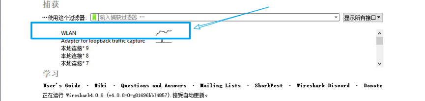

## 1.2 设置Wireshark过滤器

设置过滤器，过滤规则 “tcp.port == 80”。仅抓取tcp协议、端口号为80的包。如下图所示。

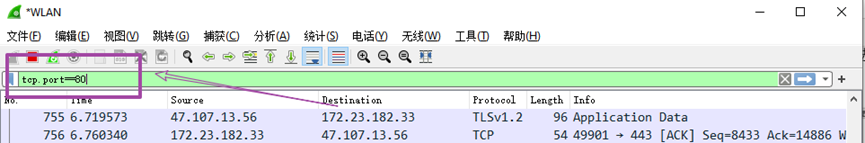

## 1.3 开始Wireshark抓包

如下图所示，Wireshark下方窗口已显示当前捕获的包，并不断增加。
 （可点击左上角绿色按钮，清空下方信息，重新开始当前捕获）

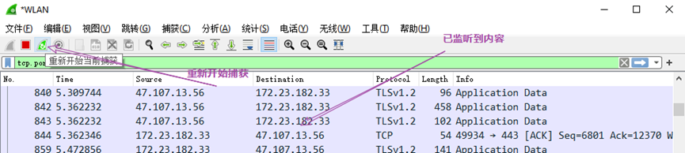

##  1.4  wget www.baidu.com

使用`wegt`工具下载www.baidu.com。
 在下载过程中，Wireshark会捕获客户端（本机）与服务器（百度）的通信过程，而后我们将对捕获内容进行分析。

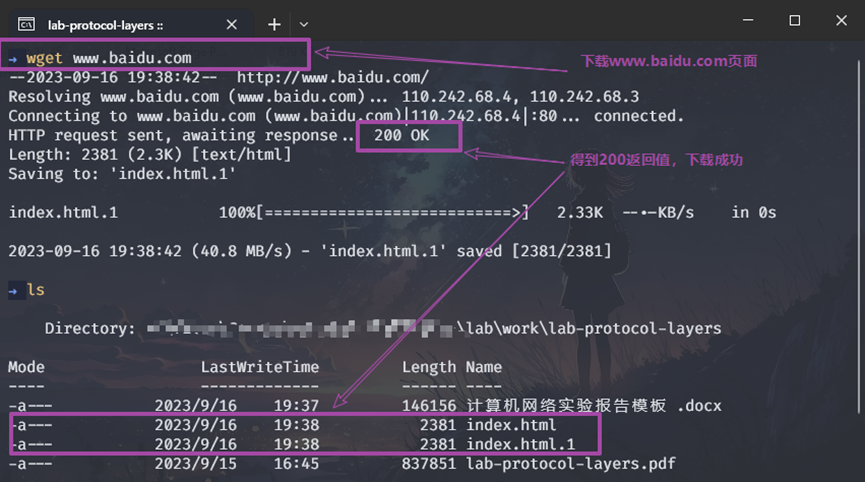

## 1.5 检查抓包结果

查看Wireshark窗口，可发现已经捕获到一些内容。
其中，可找到两条Protocol为HTTP的trace。其中第一条为客户端向服务器发送的GET请求，而第二条HTTP协议的trace为服务器向客户端发送的包含200OK的响应。

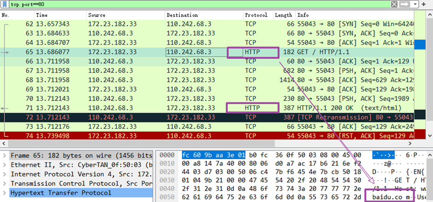

# 02 问题分析与回答

## 2.1 Turn-in 1：Hand in your packet drawing.

***In Step3：Packet Structure。Draw a figure of an HTTP GET packet that shows the position and size in bytes of the TCP, IP and Ethernet protocol headers.***

操作：选中HTTP GET的 trace，查看Wireshark下方窗口显示的相关结构信息。

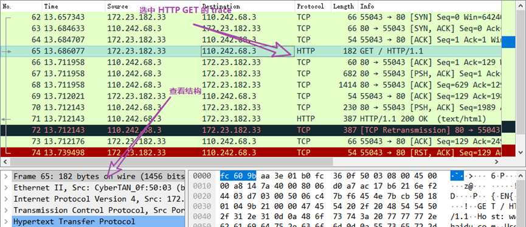

结果：绘制结构如下图所示。

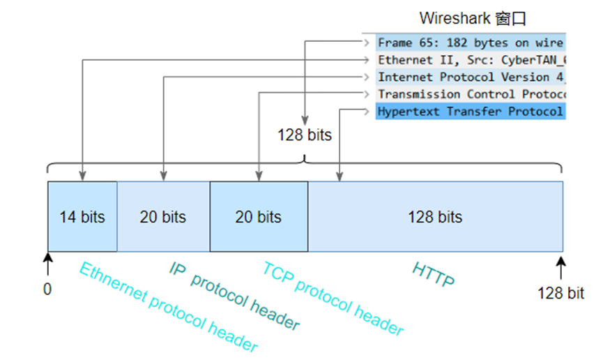

## 2.2 Turn-in 2

***Your estimate of download protocol overhead as defined above. Tell us whether you find this overhead to be significant.***

*（In Step4：Estimate the download protocol overhead, or percentage of the download bytes taken up by protocol overhead. To do this, consider HTTP data (headers and message) to be useful data for the network to carry, and lower layer headers (TCP, IP, and Ethernet) to be the overhead. ）*

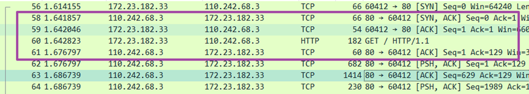

如上图所示，找到HTTP GET的条目，向上找到包含[SYN,ACK]条目，向下扎到HTTP GET下面的第一个 TCP [ACK] 的条目，对这段区域进行计算。

由Turn-in 1表格HTTP GET结构图可知，HTTP有效数据为128bits，其余为协议开销。

因而协议开销为
$$
66+54+(182-128)+60=234bits
$$
协议开销占比为
$$
\frac{234}{234+128}\times100\%=64.6\%
$$

## 2.3 Turn-in 3: Hand in your answers to the two questions.

*（In Step5）*

***1.**  **Which Ethernet header field is the demultiplexing key that tells it the next higher layer is IP? What value is used in this field to indicate “IP”?*** 

***2.**  **Which IP header field is the demultiplexing key that tells it the next higher layer is TCP? What value is used in this field to indicate “TCP”?***

Demultiplexing Keys，即解复用键。当数据包从交给上层进行处理时，需要找到正确的上层协议，这个过程就叫做解复用；解复用键即在协议头中来指明上层协议的信息。

**1. Ethernet**：查看Wireshark的Ethernet字段，得知报头字段为 Type ，其值为 0x0800 。

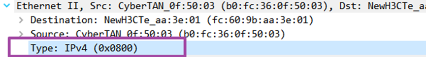

**2. IP**：IP报头字段为Protocol，其值为0x06 。

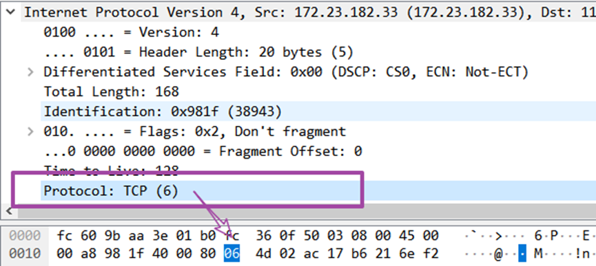

# 03  Explore on your own

*1)*   ***Look at a short TCP packet that carries no higher-layer data. To what entity is this packet des-tined? After all, if it carries no higher-layer data then it does not seem very useful to a higher layer protocol such as HTTP!***

查看Wireshark中TCP协议包，如下图所示。

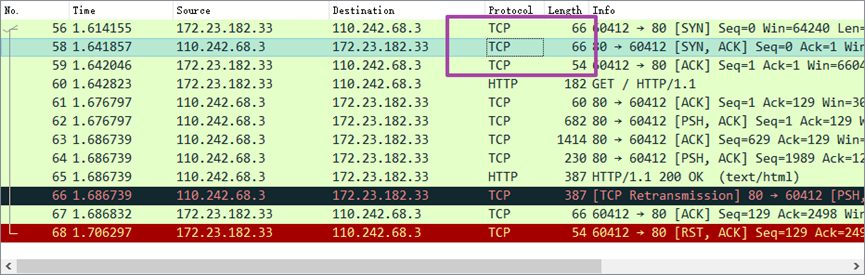

建立TCP连接需要三次握手，在三次握手协议中，需要客户端向服务器建立连接请求、服务器向客户端确认请求、客户端向服务器确认收到，这些数据包都是不含更高层的短TCP。

*2)*   ***In a classic layered model, one message from a higher layer has a header appended by the lower layer and becomes one new message. But this is not always the case. Above, we saw a trace in which the web response (one HTTP message comprised of an HTTP header and an HTTP pay-load) was converted into multiple lower layer messages (being multiple TCP packets). Imagine that you have drawn the packet structure (as in step 2) for the first and last TCP packet carrying the web response. How will the drawings differ?*** 

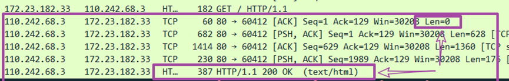

Web响应数据包如上图所示。其中第一个数据包为TCP协议，可以发现其中负载长度为0，仅包含通信控制信息；而最后一个显示为HTTP协议，其中包含web的200 ok响应。
