<!DOCTYPE html>
<html lang="en">
<head>
    <meta charset="UTF-8">
    <meta name="viewport" content="width=device-width, initial-scale=1.0">
    <title>实验报告封面</title>
    <style>
        .cover {
            font-family: 华文楷体, sans-serif;
            font-size: 18pt;
            margin-top: 0px;
            padding: 0;
            display: flex;
            align-items: center;
            justify-content: center;
            min-height: 100vh;
            /* page-break-before: auto;  或者直接删除这行 */
        }
        .cover #cover {
            text-align: center;
            position: relative;
        }
        .cover #logo {
            max-width: 100%;
            margin: 40px auto;
            display: block;
        }
        .cover #course {
            font-family: "华文行楷", sans-serif;
            font-size: 64px;
            margin: 20px;
            line-height: 1.3;
        }
        .cover #experiment {
            font-family: "华文楷体", sans-serif;
            font-size: 40px;
            margin: 30px 0;
        }
        .cover #info {
            text-align: center;
            margin: 20px;
            margin-top: 120px;
            position: relative;
        }
        .cover #info span {
            display: inline-block;
            text-align: left;
        }
        .cover #info span.label {
            font-family: "华文楷体", sans-serif;
            font-size: 22px;
            width: 100px;
        }
        .cover #info span.line {
            border-bottom: 1px solid #000;
            width: 150px;
            margin-bottom: -2pt;
            margin-left: -50px;
            display: inline-block;
            position: relative;
        }
        .cover #info span.text {
            position: absolute;
            font-family: "华文楷体", sans-serif;
            font-size: 22px;
            top: -16pt;
            left: 0;
            right: 0;
            text-align: center;
        }
    </style>
</head>
<body>
    <div class="cover">
        <div id="cover">
                        <div id="course">计算机网络<br/>实验报告</div>
            <div id="experiment">Lab1 HTTP</div>
            <div id="info">
                <span class="label">姓名：</span>
                <span class="line">
                    <span class="text">O2iginal</span>
                </span><br>
                <span class="label">学号：</span>
                <span class="line">
                    <span class="text">O2iginal ID</span>
                </span><br>
                <span class="label">日期：</span>
                <span class="line">
                    <span class="text">2023-10-01</span>
                </span>
            </div>
        </div>
    </div>
</body>
</html>


<div>
    <div style="width:80px;float:left; font-family:方正公文黑体;">
        实验目的：
    </div>
    <div style="overflow:hidden; font-family:华文楷体;">
        通过WireShark抓包了解HTTP协议。
    </div>
    <div style="width:80px;float:left; font-family:方正公文黑体;">
        实验环境：
    </div>
    <div style="overflow:hidden; font-family:华文楷体;">
        WireShark； Telnet； Browser；
    </div>
</div>
<hr>
<center>
    <b>
        <h1>实验报告目录</h1>
    </b>
</center>


[TOC]

#  Step 1: Manual GET with Telnet

##  1.1 Telnet实验过程

手动使用Telnet发送GET请求。以www.baidu.com为例，向其发送GET请求，获取其首页的HTML文件。步骤如下：

1）打开命令行，输入telnet www.baidu.com 80，连接到百度服务器的80端口。
```sh
o2igin@DESKTOP-60A5SFR:~/Temp$ telnet www.baidu.com 80
Trying 39.156.66.18...
Connected to www.a.shifen.com.
Escape character is '^]'.
```

2）输入GET请求，获取百度首页的HTML文件。

（注意命令结尾的空行，表示请求结束。）
```sh
GET / HTTP/1.1
Host: www.baidu.com

```

3）服务器返回响应，包含百度首页的HTML文件。

截取相应的部分内容，如下：
```sh
HTTP/1.1 200 OK
Accept-Ranges: bytes
Cache-Control: no-cache
Connection: keep-alive
Content-Length: 9508
Content-Type: text/html
Date: Fri, 10 Nov 2023 06:10:06 GMT
P3p: CP=" OTI DSP COR IVA OUR IND COM "
P3p: CP=" OTI DSP COR IVA OUR IND COM "
Pragma: no-cache
Server: BWS/1.1
Set-Cookie: BAIDUID=8D7E96845969F15936CC0DAFDE717D4F:FG=1; expires=Thu, 31-Dec-37 23:55:55 GMT; max-age=2147483647; path=/; domain=.baidu.com
Set-Cookie: BIDUPSID=8D7E96845969F15936CC0DAFDE717D4F; expires=Thu, 31-Dec-37 23:55:55 GMT; max-age=2147483647; path=/; domain=.baidu.com
Set-Cookie: PSTM=1699596606; expires=Thu, 31-Dec-37 23:55:55 GMT; max-age=2147483647; path=/; domain=.baidu.com
Set-Cookie: BAIDUID=8D7E96845969F1596E5F1905C148EE5A:FG=1; max-age=31536000; expires=Sat, 09-Nov-24 06:10:06 GMT; domain=.baidu.com; path=/; version=1; comment=bd
Traceid: 169959660604163427948605995292194033382
Vary: Accept-Encoding
X-Ua-Compatible: IE=Edge,chrome=1

<!DOCTYPE html><html><head><meta http-equiv="Content-Type" content="text/html; charset=UTF-8"><meta http-equiv="X-UA-Compatible" content="IE=edge,chrome=1"><meta content="always" name="referrer"><meta name="description" content="全球领先的中文搜索引擎、致力于让网民更便捷地获取信息，找到所求。百 度超过千亿的中文网页数据库，可以瞬间找到相关的搜索结果。">
```
相应内容的前几行包含了响应的状态行和响应头部，后面的内容是响应体，包含了百度首页的HTML文件。

## 1.2 Step1问题回答

### 问题1：HTTP版本

*What version of HTTP is the server running?*

**答：**HTTP版本为1.1，此信息可从响应的第一行得到。如下图所示。
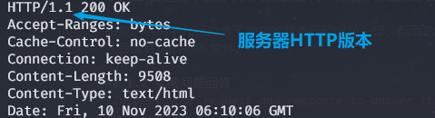

### 问题2：客户端如何识别内容开始

*How is the beginning of the content sent by the server recognized by the client?*

**答：**服务器发送的内容的开始由客户端根据头部后的两个换行符（CRLF - 回车符和换行符）来识别。在HTTP响应中，头部和内容主体之间由两个连续的CRLF序列（`\r\n\r\n`）分隔。由此客户端知道内容主体即将开始。

如下图所示，两个连续的CRLF序列产生了一个空行，随后即为相应内容主体部分。
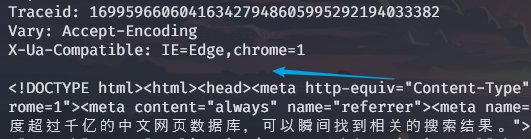

### 问题3：内容类型识别

*How does the client know what type of content is returned?*

**答：**客户端通过HTTP响应中的`Content-Type`头部知道返回的内容类型。如本次实验的响应内容中，`Content-Type`设置为`text/html`，表示返回的内容是HTML文本。

```
Content-Type: text/html
```

`Content-Type`头部告知客户端内容的媒体类型，从而使其能够适当地解释和显示内容。

# Step 2: Capture a Trace
在此步骤中，选择两个使用HTTP协议的URL进行抓包实验。其中要求一个URL对应中等大小的图片（如`.png`），另一个则对应网站主页（如百度主页，包含若干元素）。

## 2.1 选择实验所用的URL

这里选择如下两个ULR：
1. http://www.baidu.com/img/flexible/logo/plus_logo_web_2.png （百度logo的png图片）


2. http://www5.baidu.com/ （百度的http协议的url）
    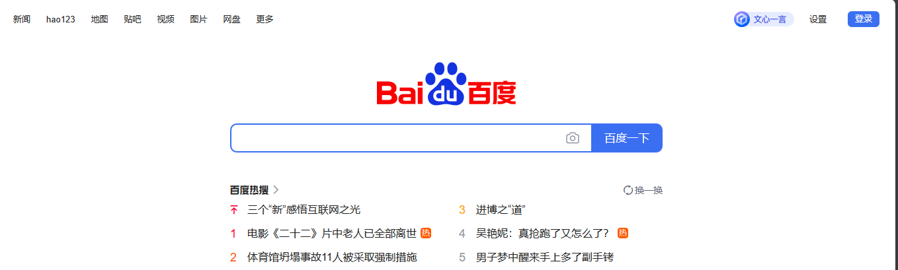

## 2.2 Wireshark抓包前准备

首先设置Wireshark过滤规则，`tcp.port==80`，同时关闭其他可能产生tcp80端口流量的进程，避免影响实验。

首先进行抓包前准备如下：
1. Wireshark过滤规则，`tcp.port==80`；
2. 清除此前测试时，对于上述两个url的缓存；
3. 关闭不必要进程，减少其他网络流量对于实验的影响；

## 2.3 Wire抓包实验过程

1）启动Wireshark，等待一段时间，确定tcp80端口没有其他流量。

2）在浏览器中粘贴输入静态图片URL，即http://www.baidu.com/img/flexible/logo/plus_logo_web_2.png。此时Wireshark得到若干tcp80端口的网络包。如下图所示。
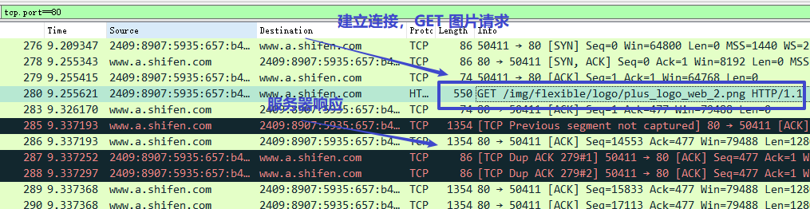

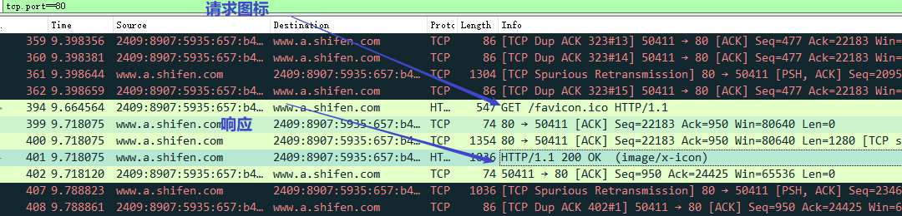

3）等待一段时间，当不再有新的包被捕获时，再次粘贴输入步骤2中的静态图片URL、回车。此时WireShark可捕获到第二次请求的网络流量，如下图所示。
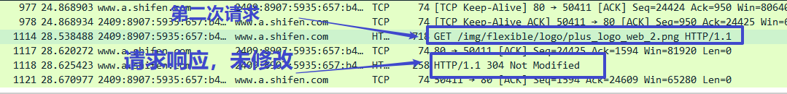

4）浏览器粘贴输入百度主页的url http://www5.baidu.com/。WireShark监听得到若干请求与相应包，其中包含网页中若干元素的多次请求。如下图所示，列出主页的请求响应以及页面中一个资源（js脚本文件）的请求响应（仍有若干其他资源请求）。
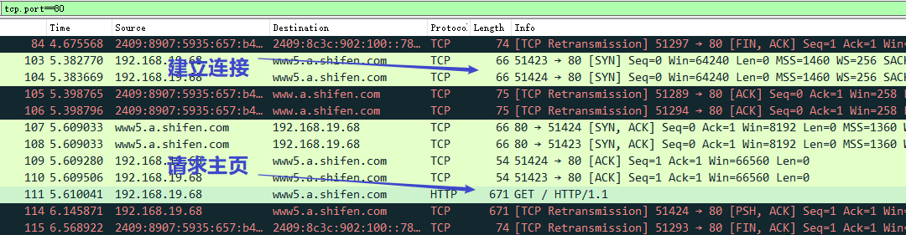

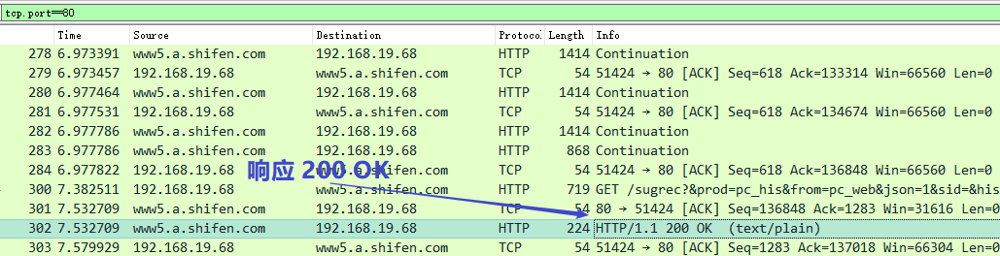

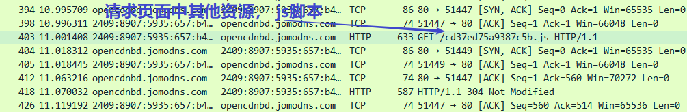

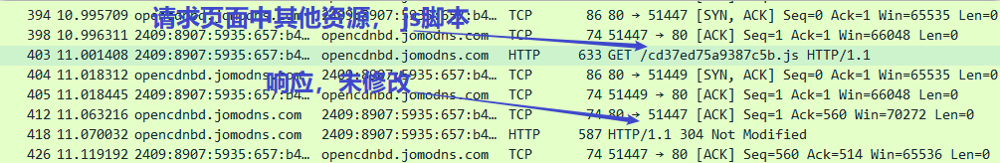

# Step 3: Inspect the Trace

## 3.1 添加HTTP过滤器
查看Wireshark捕获的Trace，添加HTTP过滤器，以便于查看HTTP协议相关的网络包。如下图所示。
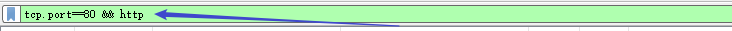

## 3.2 查看HTTP请求与响应
如下图所示，前两个网络包为HTTP请求，分别为url对应的静态图片、网页图标，第三个为HTTP相应200OK。
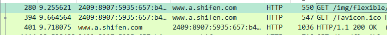

## 3.3 查看HTTP请求头部
查看第一个GET请求的HTTP头部，如下图所示。
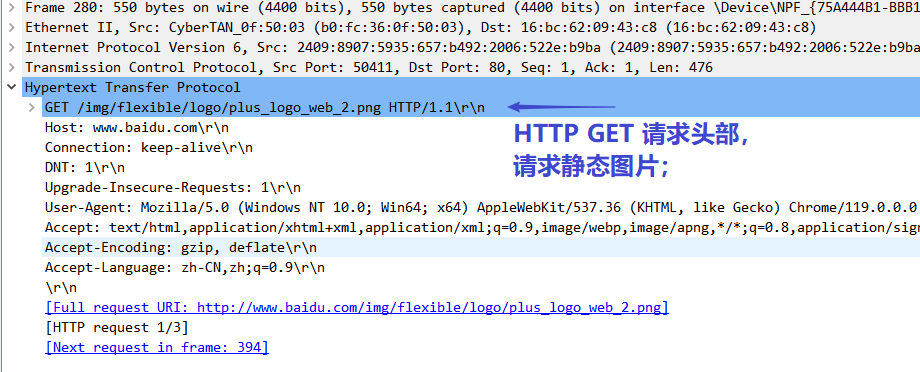

```
GET /img/flexible/logo/plus_logo_web_2.png HTTP/1.1\r\n
```
第一行为请求行，包含了请求方法、请求的URL、HTTP版本。其中请求方法为GET，请求的URL为`/img/flexible/logo/plus_logo_web_2.png`，HTTP版本为1.1。

```
Host: www.baidu.com\r\n
```
第二行为`Host`头部，指定了请求的服务器的域名。

```
Connection: keep-alive\r\n
```
第三行为`Connection`头部，指定了客户端与服务器之间的连接类型。`keep-alive`表示客户端与服务器之间的连接是持久的，即不会在每次请求后断开连接。

```
DNT: 1\r\n
```
第四行为`DNT`头部，表示客户端不希望被跟踪。

```
Upgrade-Insecure-Requests: 1\r\n
```
第五行为`Upgrade-Insecure-Requests`头部，表示客户端希望服务器将其请求重定向到HTTPS。

```
User-Agent: Mozilla/5.0 (Windows NT 10.0; Win64; x64) AppleWebKit/537.36 (KHTML, like Gecko) Chrome/119.0.0.0 Safari/537.36 Edg/119.0.0.0\r\n
```
第六行为`User-Agent`头部，表示客户端的浏览器信息。

```
Accept: text/html,application/xhtml+xml,application/xml;q=0.9,image/webp,image/apng,*/*;q=0.8,application/signed-exchange;v=b3;q=0.7\r\n
```
第七行为`Accept`头部，表示客户端能够接受的媒体类型。

```
Accept-Encoding: gzip, deflate\r\n
Accept-Language: zh-CN,zh;q=0.9\r\n
```
第八行为`Accept-Encoding`头部，表示客户端能够接受的内容编码方式。
第九行为`Accept-Language`头部，表示客户端能够接受的语言。

## 3.4 查看HTTP响应头部

查看第一个HTTP响应的头部，如下图所示。
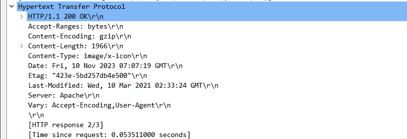

```
HTTP/1.1 200 OK\r\n
Accept-Ranges: bytes\r\n
Content-Encoding: gzip\r\n
Content-Length: 1966\r\n
Content-Type: image/x-icon\r\n
Date: Fri, 10 Nov 2023 07:07:19 GMT\r\n
Etag: "423e-5bd257db4e500"\r\n
Last-Modified: Wed, 10 Mar 2021 02:33:24 GMT\r\n
Server: Apache\r\n
Vary: Accept-Encoding,User-Agent\r\n
```
- 第一行为响应行，包含了HTTP版本、状态码、状态码描述。其中HTTP版本为1.1，状态码为200，状态码描述为OK。
- 第二行为`Accept-Ranges`头部，表示服务器支持的范围请求。
- 第三行为`Content-Encoding`头部，表示服务器对于响应内容的编码方式。
- 第四行为`Content-Length`头部，表示响应内容的长度。
- 第五行为`Content-Type`头部，表示响应内容的媒体类型。
- 第六行为`Date`头部，表示响应的时间。
- 第七行为`Etag`头部，表示响应内容的实体标签。
- 第八行为`Last-Modified`头部，表示响应内容的最后修改时间。
- 第九行为`Server`头部，表示服务器的信息。
- 第十行为`Vary`头部，表示服务器根据请求头部的`Accept-Encoding`和`User-Agent`头部来决定响应内容的编码方式。

## 3.5 Step3问题回答

### 问题1：头部行格式

*What is the format of a header line?Give a simple description that fits the headers you see.*

**答：**头部行的格式为`<header-name>: <header-value>`，其中`<header-name>`为头部名，`<header-value>`为头部值。具体头部类型如**3.3、3.4**分析所示。

### 问题2：指示响应内容类型和长度的头部

*What headers are used to indicate the kind and length of content that is returned in a response?*

**答：**指示响应内容类型的头部为`Content-Type`，指示响应内容长度的头部为`Content-Length`。

如**3.4**分析所示，
- 第五行为`Content-Type`头部，表示响应内容的媒体类型，为`image/x-icon`。
- 第四行为`Content-Length`头部，表示响应内容的长度，为1966字节。

# Step 4: Content Caching

## 4.1 查看缓存的HTTP请求与响应
如下图所示，第二次请求相同的URL时，得到了304 Not Modified的响应，表示客户端的缓存仍然有效，无需再次请求服务器。
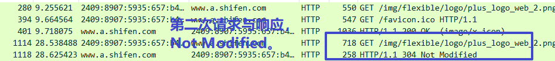

## 4.2 查看缓存的HTTP请求头部
如下图所示，当浏览器存在缓存时，请求中包含了`If-Modified-Since`头部，表示客户端缓存的最后修改时间。
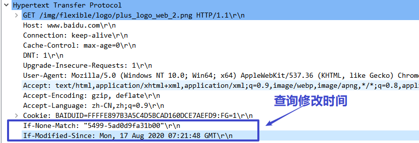

## 4.3 查看缓存的HTTP响应头部
如下图所示，服务器返回了304 Not Modified的响应，表示客户端的缓存仍然有效，无需再次请求服务器。
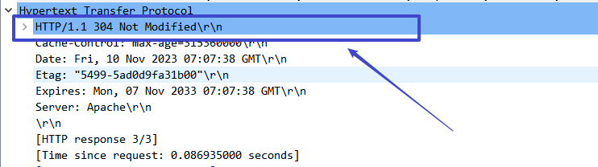

## 4.4 Step4问题回答

### 问题1：浏览器用于判断内容是否更新的请求头

*What is the name of the header the browser sends to let the server work out whether to send fresh content？*

**答：**浏览器用于判断内容是否更新的请求头为`If-Modified-Since`。

如上图所示，本实验中，第二次请求相同的URL时，请求中包含了`If-Modified-Since`头部，表示客户端缓存的最后修改时间。

### 问题2：时间戳的来源

*Where exactly does the timestamp value carried by the header come from?*

**答：**时间戳的来源为上次请求时服务器返回的`Last-Modified`头部。

# Step 5: Complex Pages

打开Wireshark的Load Distribution Panel，查看网页www5.baidu.com的加载情况。如下图所示。
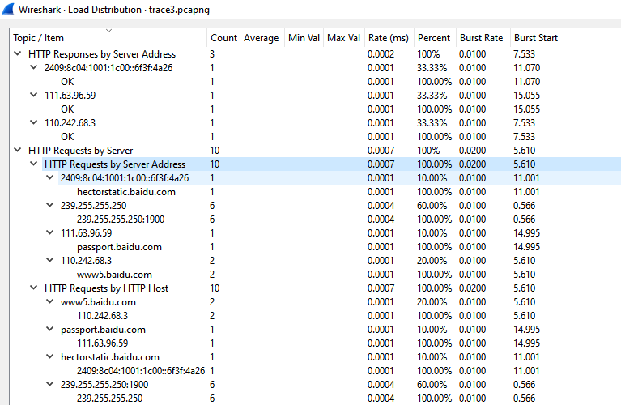

# Step 6: Explore Your Network

## 6.1 HTTP的POST请求
*Look at how an HTTP POST works. We focused on the GET method above. POST is used to up-load information to the server. You can study a POST by finding a simple web page with a formand tracing the form submission. However, do not study login forms as you want to observe anHTTP POST and not an encrypted HTTPS POST that is more typical when security is needed.*

使用[httpbin.org](http://httpbin.org/)测试HTTP的POST请求。

Wireshark抓包如下图所示。
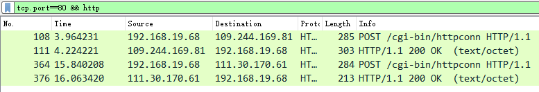

请求内容如下所示。
```sh
Hypertext Transfer Protocol
    POST /cgi-bin/httpconn HTTP/1.1\r\n
    Host: 109.244.169.81\r\n
    Accept: */*\r\n
    User-Agent: Mozilla/4.0 (compatible; MSIE 6.0; Windows NT 5.1)\r\n
    Connection: Keep-Alive\r\n
    Cache-Control: no-cache\r\n
    Accept-Encoding: gzip, deflate\r\n
    Content-Type: application/octet-stream\r\n
    Content-Length: 231\r\n
    \r\n
    [Full request URI: http://109.244.169.81/cgi-bin/httpconn]
    [HTTP request 1/1]
    [Response in frame: 111]
    File Data: 231 bytes
```

响应内容如下所示。
```sh
Hypertext Transfer Protocol
    HTTP/1.1 200 OK\r\n
    Server: httpsf2\r\n
    Connection: Keep-alive\r\n
    Content-Type: text/octet\r\n
    Content-Length: 142\r\n
    \r\n
    [HTTP response 1/1]
    [Time since request: 0.259990000 seconds]
    [Request in frame: 108]
    [Request URI: http://109.244.169.81/cgi-bin/httpconn]
    File Data: 142 bytes
```
