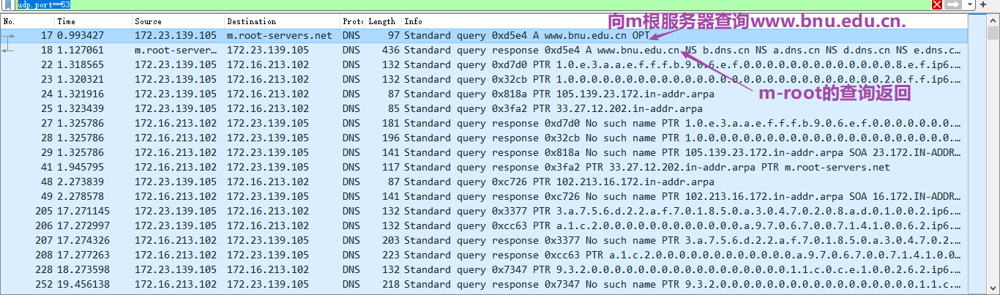
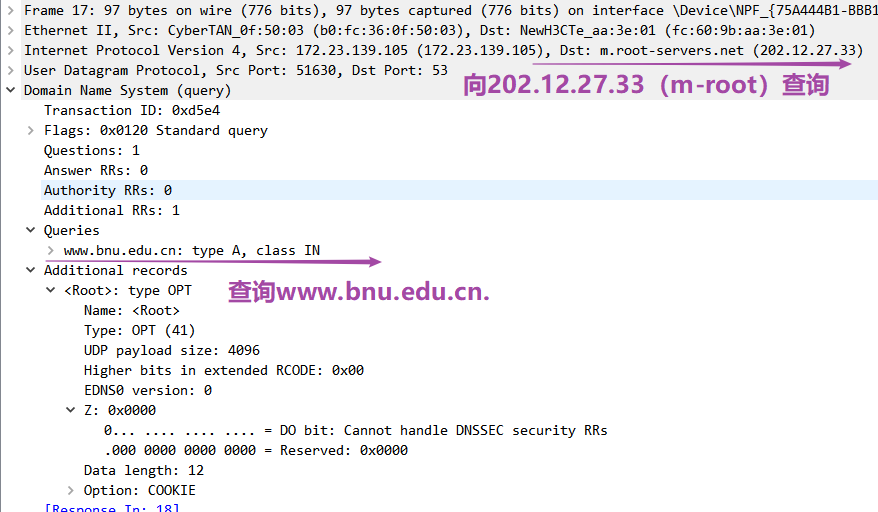
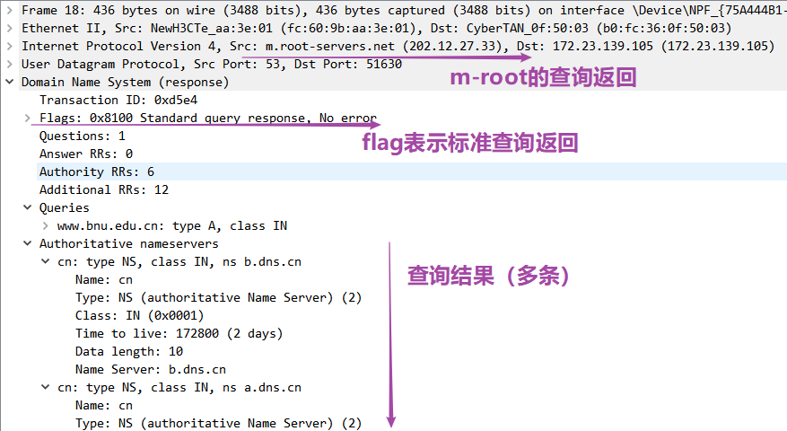
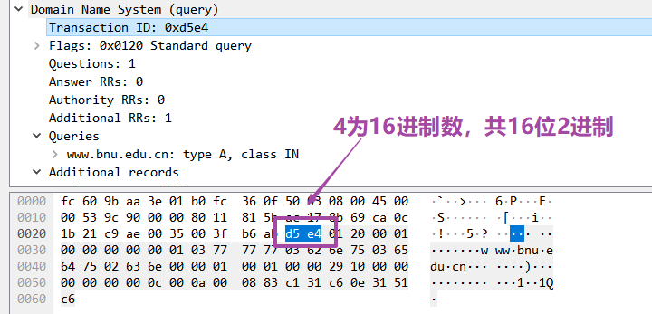
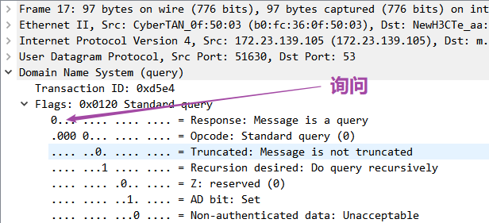
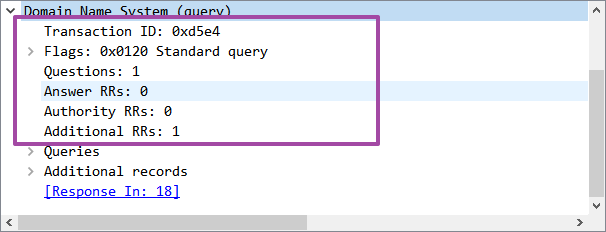
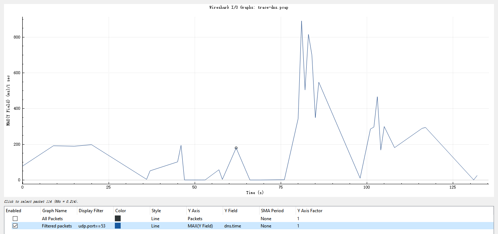

<!DOCTYPE html>
<html lang="en">
<head>
    <meta charset="UTF-8">
    <meta name="viewport" content="width=device-width, initial-scale=1.0">
    <title>实验报告封面</title>
    <style>
        .cover {
            font-family: 华文楷体, sans-serif;
            font-size: 18pt;
            margin-top: 0px;
            padding: 0;
            display: flex;
            align-items: center;
            justify-content: center;
            min-height: 100vh;
            /* page-break-before: auto;  或者直接删除这行 */
        }
        .cover #cover {
            text-align: center;
            position: relative;
        }
        .cover #logo {
            max-width: 100%;
            margin: 40px auto;
            display: block;
        }
        .cover #course {
            font-family: "华文行楷", sans-serif;
            font-size: 64px;
            margin: 20px;
            line-height: 1.3;
        }
        .cover #experiment {
            font-family: "华文楷体", sans-serif;
            font-size: 40px;
            margin: 30px 0;
        }
        .cover #info {
            text-align: center;
            margin: 20px;
            margin-top: 120px;
            position: relative;
        }
        .cover #info span {
            display: inline-block;
            text-align: left;
        }
        .cover #info span.label {
            font-family: "华文楷体", sans-serif;
            font-size: 22px;
            width: 100px;
        }
        .cover #info span.line {
            border-bottom: 1px solid #000;
            width: 150px;
            margin-bottom: -2pt;
            margin-left: -50px;
            display: inline-block;
            position: relative;
        }
        .cover #info span.text {
            position: absolute;
            font-family: "华文楷体", sans-serif;
            font-size: 22px;
            top: -16pt;
            left: 0;
            right: 0;
            text-align: center;
        }
    </style>
</head>
<body>
    <div class="cover">
        <div id="cover">
                        <div id="course">计算机网络<br/>实验报告</div>
            <div id="experiment">Lab2  DNS</div>
            <div id="info">
                <span class="label">姓名：</span>
                <span class="line">
                    <span class="text">O2iginal</span>
                </span><br>
                <span class="label">学号：</span>
                <span class="line">
                    <span class="text">O2iginal ID</span>
                </span><br>
                <span class="label">日期：</span>
                <span class="line">
                    <span class="text">2023-11-14</span>
                </span>
            </div>
        </div>
    </div>
</body>
</html>


<div>
    <div style="width:80px;float:left; font-family:方正公文黑体;">
        实验目的：
    </div>
    <div style="overflow:hidden; font-family:华文楷体;">
        通过WireShark抓包分析了解DNS系统工作原理和协议
    </div>
    <div style="width:80px;float:left; font-family:方正公文黑体;">
        实验环境：
    </div>
    <div style="overflow:hidden; font-family:华文楷体;">
        Browser; dig;
    </div>
</div>
<hr>
<center>
    <b>
        <h1>实验报告目录</h1>
    </b>
</center>

[TOC]

# Step 1: Manual Name Resolution

## 1.1 实验过程

**1）获得一个根DNS服务器IP地址**

在命令行中输入`nslookup -type=ns .`，得到根DNS服务器的IP地址为`
```sh
o2igin@DESKTOP-60A5SFR:~/Temp$ nslookup -type=ns .
Server:         192.168.144.1
Address:        192.168.144.1#53

Non-authoritative answer:
.       nameserver = a.root-servers.net.
.       nameserver = b.root-servers.net.
.       nameserver = g.root-servers.net.
.       nameserver = c.root-servers.net.
.       nameserver = j.root-servers.net.
.       nameserver = k.root-servers.net.
.       nameserver = i.root-servers.net.
.       nameserver = d.root-servers.net.
.       nameserver = f.root-servers.net.
.       nameserver = h.root-servers.net.
.       nameserver = e.root-servers.net.
.       nameserver = l.root-servers.net.
.       nameserver = m.root-servers.net.

Authoritative answers can be found from:
m.root-servers.net      internet address = 202.12.27.33
f.root-servers.net      internet address = 192.5.5.241
i.root-servers.net      internet address = 192.36.148.17
l.root-servers.net      internet address = 199.7.83.42
d.root-servers.net      internet address = 199.7.91.13
a.root-servers.net      internet address = 198.41.0.4
g.root-servers.net      internet address = 192.112.36.4
e.root-servers.net      internet address = 192.203.230.10
h.root-servers.net      internet address = 198.97.190.53
c.root-servers.net      internet address = 192.33.4.12
j.root-servers.net      internet address = 192.58.128.30
k.root-servers.net      internet address = 193.0.14.129
b.root-servers.net      internet address = 199.9.14.201
m.root-servers.net      has AAAA address 2001:dc3::35
f.root-servers.net      has AAAA address 2001:500:2f::f
```

选择`m.root-servers.net  internet address = 202.12.27.33`进行接下来的实验。

**2）利用根DNS手动进行域名解析**

选择域名`www.bnu.edu.cn`进行实验。手动迭代解析过程如下。

```sh
o2igin@DESKTOP-60A5SFR:~/Temp$ dig @202.12.27.33 www.bnu.edu.cn
# 完整输出略，选择如下一条结果继续迭代查询
# cn.                     172800  IN      NS      e.dns.cn.
o2igin@DESKTOP-60A5SFR:~/Temp$ dig @e.dns.cn. www.bnu.edu.cn
# 完整输出略，选择如下一条结果继续迭代查询
# edu.cn.                 172800  IN      NS      dns2.edu.cn. # 选择此dns继续查询
o2igin@DESKTOP-60A5SFR:~/Temp$ dig @dns2.edu.cn. www.bnu.edu.cn
# 完整输出略，选择如下一条结果继续迭代查询
# bnu.edu.cn.             172800  IN      NS      ns2.bnu.edu.cn. # 选择此dns继续查询
o2igin@DESKTOP-60A5SFR:~/Temp$ dig @ns2.bnu.edu.cn. www.bnu.edu.cn
# 完整输出略，得到如下最终www.bnu.edu.cn的解析结果
www.bnu.edu.cn.         7200    IN      A       60.247.18.7 # <--- 查询结果
```

## 1.2 问题回答：绘制解析过程的DNS服务器序列

*Draw a figure that shows the sequence of remote nameservers that you contacted and the domain for which they are responsible.*

如下图所示手动迭代查询的过程。其中，每一行代表一次迭代查询，左侧一列为查询的DNS服务器，右侧为查询的域名。


# Step 2: Capture a Trace
使用WireShark抓包工具，抓取DNS查询`www.bnu.edu.cn`的数据包。

实验前进行如下准备：
1. 设置WireShark抓包过滤器为`udp.port==53`，以便只抓取DNS查询的数据包。
2. 关闭浏览器以及其他可能的网络连接，以便只抓取DNS查询`www.bnu.edu.cn`的数据包，尽可能减少其他干扰。

抓包结果如下图所示。


# Step 3: Inspect the Trace

## 3.1 dig命令的查询trace

选择Wireshark捕获的第一条DNS查询数据包，此条trace为使用dig命令查询`www.bnu.edu.cn`的trace。如下图所示。



其中，
- Transaction ID为`0xd5e4`，表示此次查询的事务ID，该查询的返回结果也会带有此ID，以便客户端进行匹配;
- Flags字段值为`0x0120`，表示此条为标准查询。

## 3.2 dig命令的查询返回

选择Wireshark捕获的第二条DNS查询数据包，此条trace为使用dig命令查询`www.bnu.edu.cn`的返回结果。如下图所示。



# Step 4: Details of DNS Messages

## 问题1：DNS查询的事务ID   

由上图Wireshark解析可知，DNS头部中的事务ID是一个$16$位的字段。这$16$位提供了 $2^{16}$（$65536$）种可能的组合。这个相对较大的范围使得在并发的DNS事务中，使用相同的事务ID的概率变得很小，降低了事务ID冲突的可能性。

## 问题2：查询或响应标志位

DNS头部的`flags`字段包含8位标志。最高位（第一位）是"Query/Response"标志。当这个标志为0时，表示DNS消息是一个查询；为1时，表示它是一个响应。

## 问题3：DNS头部长度

DNS头部长度是12字节。DNS头部共包含6个16位字段，每个字段占用2字节，总长度为12字节。包括事务ID、标志、问题数、应答数、授权资源记录数和附加资源记录数。

## 问题4：初始响应中的名字服务器
初始响应的"`ANSWER SECTION`"包含有关根域（"."）的名称服务器的信息。这是因为初始查询是一个根域查询，根域的名称服务器信息将指导进一步的DNS解析。在"`ANSWER SECTION`"中，记录的类型是NS（Name Server），它携带了名字服务器的名称。

例如实验中：
```sh
;; ANSWER SECTION:
.                       458996  IN      NS      a.root-servers.net.
.                       458996  IN      NS      b.root-servers.net.
.                       458996  IN      NS      i.root-servers.net.
```

## 问题5：初始响应中名字服务器的IP地址
初始响应的"`ADDITIONAL SECTION`"包含了与名字服务器相关的IP地址信息。这些IP地址对应于在"ANSWER SECTION"中提到的名称服务器。在"`ADDITIONAL SECTION`"中，记录的类型可以是A（`IPv4 Address）或AAAA（IPv6 Address），分别表示IPv4和IPv6地址。

## 问题6：最终响应中域名的IP地址
终响应的"ANSWER SECTION"包含了域名的IP地址。在DNS解析的过程中，经过一系列迭代查询，最终的响应将包含目标域名的IP地址。在"ANSWER SECTION"中，记录的类型为A（IPv4 Address），携带了目标域名的IPv4地址。

例如实验中：
```sh
;; ANSWER SECTION:
www.bnu.edu.cn.         7200    IN      A       60.247.18.7
```

# Step 5: DNS Response Time
在Wireshark中生成如下IO图反映了DNS响应时间的分布情况。该图以时间为横轴，以DNS响应时间为纵轴，通过这个图我们可以观察到不同DNS查询的响应时间分布。

- **X轴刻度：** 横轴表示时间，已将刻度间隔设置为一秒，以便清晰观察整个跟踪过程。

- **Y轴刻度：** 纵轴表示DNS响应时间。Wireshark通过虚拟字段`dns.time`计算出DNS响应时间。Y轴的刻度根据最大响应时间进行调整，以捕捉可能的异常响应。

在图中，你会看到大部分的DNS响应时间较小，这可能是因为正确的答案被本地名称服务器缓存。然而，也可能会出现散布的较大响应时间，这可能是由于需要查询远程名称服务器而产生的延迟。



# Explore Your Network
## 探索1：查找其他类型的DNS记录
1）查询BNU邮件服务器（MX记录）.
```sh
C:\Users\23692>dig info@mail.bnu.edu.cn MX

; <<>> DiG 9.16.44 <<>> info@mail.bnu.edu.cn MX
;; global options: +cmd
;; Got answer:
;; ->>HEADER<<- opcode: QUERY, status: NXDOMAIN, id: 14850
;; flags: qr rd ra; QUERY: 1, ANSWER: 0, AUTHORITY: 1, ADDITIONAL: 1

;; OPT PSEUDOSECTION:
; EDNS: version: 0, flags:; udp: 4096
; COOKIE: b3c3d0c579fa4bd7787c377865536b21f6c4c89d4db81eb8 (good)
;; QUESTION SECTION:
;info\@mail.bnu.edu.cn.         IN      MX

;; AUTHORITY SECTION:
bnu.edu.cn.             7200    IN      SOA     ns.bnu.edu.cn. admin.example.com. 2000002637 10800 900 604800 86400

;; Query time: 5 msec
;; SERVER: 172.16.213.102#53(172.16.213.102)
;; WHEN: Tue Nov 14 20:42:11 China Standard Time 2023
;; MSG SIZE  rcvd: 133
```
2）查询BNU服务器的ipv6地址
```sh
C:\Users\23692>dig www.bnu.edu.cn AAAA

; <<>> DiG 9.16.44 <<>> www.bnu.edu.cn AAAA
;; global options: +cmd
;; Got answer:
;; ->>HEADER<<- opcode: QUERY, status: NOERROR, id: 29748
;; flags: qr rd ra; QUERY: 1, ANSWER: 1, AUTHORITY: 0, ADDITIONAL: 1

;; OPT PSEUDOSECTION:
; EDNS: version: 0, flags:; udp: 4096
; COOKIE: e035bd1f59d3622c9d9cd7b965536b7cc2af7ccc1f2ef0d6 (good)
;; QUESTION SECTION:
;www.bnu.edu.cn.                        IN      AAAA

;; ANSWER SECTION:
www.bnu.edu.cn.         126     IN      AAAA    2001:da8:207:e214::3

;; Query time: 97 msec
;; SERVER: 172.16.213.102#53(172.16.213.102)
;; WHEN: Tue Nov 14 20:43:42 China Standard Time 2023
;; MSG SIZE  rcvd: 99
```

## 探索2：尝试使用Google Public DNS
得知Google Public DNS的地址是：

- IPv4：`8.8.8.8` 和 `8.8.4.4`
- IPv6：`2001:4860:4860::8888` 和 `2001:4860:4860::8844`

使用`8.8.8.8`查询DNS：
```sh
C:\Users\23692>dig google.com @8.8.8.8

; <<>> DiG 9.16.44 <<>> google.com @8.8.8.8
;; global options: +cmd
;; Got answer:
;; ->>HEADER<<- opcode: QUERY, status: NOERROR, id: 60895
;; flags: qr rd ra; QUERY: 1, ANSWER: 1, AUTHORITY: 0, ADDITIONAL: 1

;; OPT PSEUDOSECTION:
; EDNS: version: 0, flags:; udp: 512
;; QUESTION SECTION:
;google.com.                    IN      A

;; ANSWER SECTION:
google.com.             136     IN      A       172.217.160.78

;; Query time: 166 msec
;; SERVER: 8.8.8.8#53(8.8.8.8)
;; WHEN: Tue Nov 14 20:46:44 China Standard Time 2023
;; MSG SIZE  rcvd: 55
```

## 探索3：进行反向DNS查找
反向查找之前查到的BNU服务器IP`60.247.18.7`对应的域名。

可使用如下两种工具查询：
1）使用dig
```sh
C:\Users\23692>dig -x 60.247.18.7

; <<>> DiG 9.16.44 <<>> -x 60.247.18.7
;; global options: +cmd
;; Got answer:
;; ->>HEADER<<- opcode: QUERY, status: NOERROR, id: 22171
;; flags: qr rd ra; QUERY: 1, ANSWER: 1, AUTHORITY: 0, ADDITIONAL: 1

;; OPT PSEUDOSECTION:
; EDNS: version: 0, flags:; udp: 4096
; COOKIE: 537963ad66f4811e1c1b373a65536c925495ea7ef3d0f1f8 (good)
;; QUESTION SECTION:
;7.18.247.60.in-addr.arpa.      IN      PTR

;; ANSWER SECTION:
7.18.247.60.IN-ADDR.ARPA. 43200 IN      PTR     7.18.247.60.static.bjtelecom.net.

;; Query time: 1007 msec
;; SERVER: 172.16.213.102#53(172.16.213.102)
;; WHEN: Tue Nov 14 20:48:19 China Standard Time 2023
;; MSG SIZE  rcvd: 151
```

2）使用nslookup
```sh
C:\Users\23692>nslookup 60.247.18.7
Server:  UnKnown
Address:  172.16.213.102
```

## 探索4：了解DNSSEC并执行DNSSEC查找
DNSSEC是DNS的安全扩展，使用额外的DNS记录类型返回密钥和签名信息，以便域名服务器可以验证响应的真实性。
```sh
C:\Users\23692>dig +dnssec www.bnu.edu.cn

; <<>> DiG 9.16.44 <<>> +dnssec www.bnu.edu.cn
;; global options: +cmd
;; Got answer:
;; ->>HEADER<<- opcode: QUERY, status: NOERROR, id: 9743
;; flags: qr rd ra; QUERY: 1, ANSWER: 1, AUTHORITY: 0, ADDITIONAL: 1

;; OPT PSEUDOSECTION:
; EDNS: version: 0, flags:; udp: 4096
; COOKIE: aa56f33645196f8cce88cedc65536d3a9184936b52580b80 (good)
;; QUESTION SECTION:
;www.bnu.edu.cn.                        IN      A

;; ANSWER SECTION:
www.bnu.edu.cn.         5963    IN      A       60.247.18.7

;; Query time: 2 msec
;; SERVER: 172.16.213.102#53(172.16.213.102)
;; WHEN: Tue Nov 14 20:51:08 China Standard Time 2023
;; MSG SIZE  rcvd: 87
```