<!DOCTYPE html>
<html lang="en">
<head>
    <meta charset="UTF-8">
    <meta name="viewport" content="width=device-width, initial-scale=1.0">
    <title>实验报告封面</title>
    <style>
        .cover {
            font-family: 华文楷体, sans-serif;
            font-size: 18pt;
            margin-top: 0px;
            padding: 0;
            display: flex;
            align-items: center;
            justify-content: center;
            min-height: 100vh;
            /* page-break-before: auto;  或者直接删除这行 */
        }
        .cover #cover {
            text-align: center;
            position: relative;
        }
        .cover #logo {
            max-width: 100%;
            margin: 40px auto;
            display: block;
        }
        .cover #course {
            font-family: "华文行楷", sans-serif;
            font-size: 64px;
            margin: 20px;
            line-height: 1.3;
        }
        .cover #experiment {
            font-family: "华文楷体", sans-serif;
            font-size: 40px;
            margin: 30px 0;
        }
        .cover #info {
            text-align: center;
            margin: 20px;
            margin-top: 120px;
            position: relative;
        }
        .cover #info span {
            display: inline-block;
            text-align: left;
        }
        .cover #info span.label {
            font-family: "华文楷体", sans-serif;
            font-size: 22px;
            width: 100px;
        }
        .cover #info span.line {
            border-bottom: 1px solid #000;
            width: 150px;
            margin-bottom: -2pt;
            margin-left: -50px;
            display: inline-block;
            position: relative;
        }
        .cover #info span.text {
            position: absolute;
            font-family: "华文楷体", sans-serif;
            font-size: 22px;
            top: -16pt;
            left: 0;
            right: 0;
            text-align: center;
        }
    </style>
</head>
<body>
    <div class="cover">
        <div id="cover">
                        <div id="course">计算机网络<br/>实验报告</div>
            <div id="experiment">Lab3  TCP</div>
            <div id="info">
                <span class="label">姓名：</span>
                <span class="line">
                    <span class="text">O2iginal</span>
                </span><br>
                <span class="label">学号：</span>
                <span class="line">
                    <span class="text">O2iginal ID</span>
                </span><br>
                <span class="label">日期：</span>
                <span class="line">
                    <span class="text">2023-11-14</span>
                </span>
            </div>
        </div>
    </div>
</body>
</html>


<div>
    <div style="width:80px;float:left; font-family:方正公文黑体;">
        实验目的：
    </div>
    <div style="overflow:hidden; font-family:华文楷体;">
        通过WireShark抓包分析TCP协议的包结构和使用方法。
    </div>
    <div style="width:80px;float:left; font-family:方正公文黑体;">
        实验环境：
    </div>
    <div style="overflow:hidden; font-family:华文楷体;">
        WireShark；wget/curl；Browser
    </div>
</div>
<hr>
<center>
    <b>
        <h1>实验报告目录</h1>
    </b>
</center>

[TOC]

# Step 1: Capture a Trace

## 1.1 选择合适的下载目标

下载目标要求：
1. 使用HTTP协议，而不是HTTPS协议。
2. 为独立的对象，而不是网页等复合对象。
3. 大小适中，能够在几秒钟内下载完成，以便于在Wireshark中进行分析。

这里选择实验文档中的示例目标，http://conferences.sigcomm.org/sigcomm/2011/papers/sigcomm/p2.pdf。

## 1.2 设置WireShark过滤器

仅捕获与下载目标相关的数据包，
设置过滤器为`tcp and ip.host==server.hosting3.acm.org`。

## 1.3 开始下载并监听

打开WireShark，开始监听，然后在终端使用wget下载目标文件。

```shell
wget http://conferences.sigcomm.org/sigcomm/2011/papers/sigcomm/p2.pdf
```

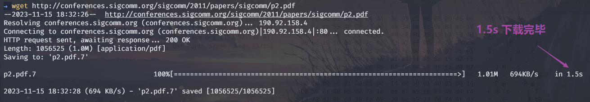

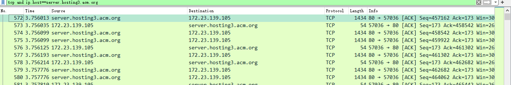

# Step 2: Inspect the Trace

在WireShark中，选中传输中间部分的一数据包进行分析，如下如所示。
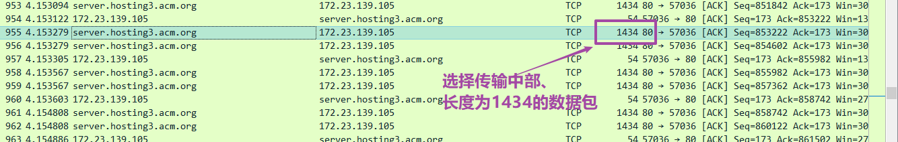

查看数据包的TCP协议部分如下。
```shell
Transmission Control Protocol, Src Port: 80, Dst Port: 57036, Seq: 853222, Ack: 173, Len: 1380
    Source Port: 80
    Destination Port: 57036
    [Stream index: 1]
    [Conversation completeness: Complete, WITH_DATA (47)]
    [TCP Segment Len: 1380]
    Sequence Number: 853222    (relative sequence number)
    Sequence Number (raw): 1304644580
    [Next Sequence Number: 854602    (relative sequence number)]
    Acknowledgment Number: 173    (relative ack number)
    Acknowledgment number (raw): 4213773731
    0101 .... = Header Length: 20 bytes (5)
    Flags: 0x010 (ACK)
    Window: 237
    [Calculated window size: 30336]
    [Window size scaling factor: 128]
    Checksum: 0xec83 [unverified]
    [Checksum Status: Unverified]
    Urgent Pointer: 0
    [Timestamps]
    [SEQ/ACK analysis]
    TCP payload (1380 bytes)
    [Reassembled PDU in frame: 1137]
    TCP segment data (1380 bytes)
```
其中，
- `Source Port`和`Destination Port`分别表示源端口和目的端口。
- `Sequence Number`表示序列号，用于标识TCP报文段的顺序。
- `Acknowledgment Number`表示确认号，表示期望收到的下一个报文段的序列号。
- `Header Length`表示TCP报文段的首部长度，单位为4字节。
- `Flags`表示标志位，其中`ACK`表示确认位。
- `Window`表示窗口大小，单位为字节。
- `Checksum`表示校验和。
- `Urgent Pointer`表示紧急指针。
- `TCP payload`表示TCP报文段的数据部分。
- `TCP segment data`表示TCP报文段的数据部分。

# Step 3: TCP Segment Structure

## 绘制TCP报文段结构图

*To show your understanding of TCP,sketch a figure of the TCP segment you studied.It should show the position and size in bytes of the TCP header fields you can observe using Wireshark.*

绘制TCP报文段结构图如下所示。


# Step 4: TCP Connection Setup/Teardown

## 4.1 Three-Way Handshake（绘制时间序列图）

查看Wireshark抓包结果，可找到如下图所示的三次握手过程。
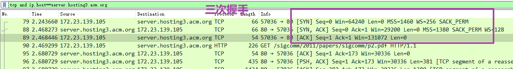

绘制时间序列图如下所示。


## 4.2 Connection Options（查看TCP选项）

查看Wireshark抓包结果，可找到如下图所示的连接选项。
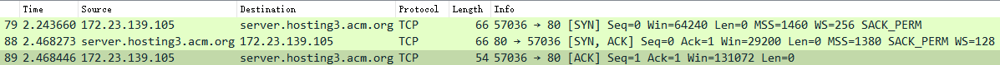

总结如下：
- 第一个数据包是客户端发起的 SYN 数据包，携带了如下 TCP 选项：
  - MSS (Maximum Segment Size): 1460
  - WS (Window Scale): 256

- 第二个数据包是服务器回复的 SYN-ACK 数据包，携带了如下 TCP 选项：
  - MSS (Maximum Segment Size): 1380
  - SACK_PERM (Selective Acknowledgment Permitted)
  - WS (Window Scale): 128

因此，根据抓包结果可知，本次实验 SYN 数据包和 SYN-ACK 数据包中携带的 TCP 选项分别是：

SYN 数据包：
- MSS: 1460
- WS: 256

SYN-ACK 数据包：
- MSS: 1380
- SACK_PERM
- WS: 128

## 4.3 FIN/RST Teardown（绘制TCP连接关闭的时间序列图）

在本次实验中，多次测试均得到了RST数据包。RST数据包是用来强制关闭连接的，当客户端或服务器端出现异常时，会发送RST数据包，强制关闭连接。如下图所示。
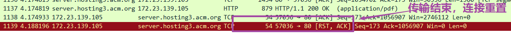


为进一步了解TCP连接的关闭过程，这里选择使用实验文档提供的Wireshark抓包结果进行分析。如下图所示。

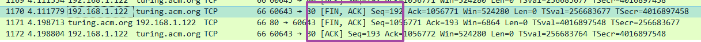

绘制TCP连接关闭过程的时间序列图如下所示。


# Step 5: TCP Data Transfer

## 问题1：TCP连接下载速度

*What is the rough data rate in the download direction in packets/second and bits/second once the TCP connection is running well?*

在Wireshark中使用I/O Graphs功能，在过滤器中添加`tcp.srcport==80`，绘制TCP连接下载速度的折线图如下所示。

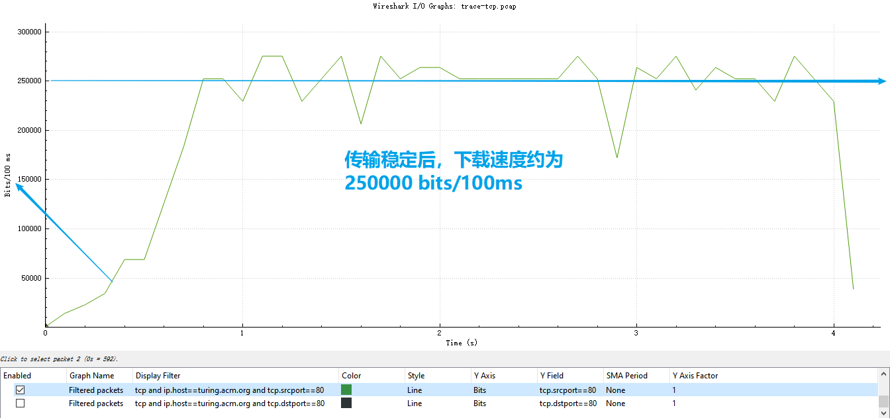

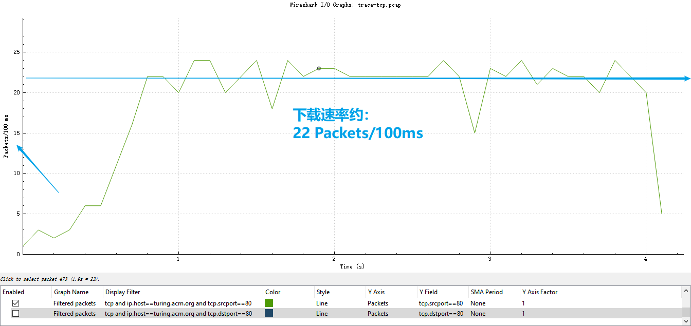

由图可知，TCP连接下载速度的大致数据率为：$220\ packets/second$和$2.5 \times 10^{6}\ bits/second$。

## 问题2：下载速度中内容负载占比

*What percentage of this download rate is content? Show your calculation. To find out, look at a typical download packet; there should be many similar, large download packets. You can see how long it is, and how many bytes of TCP payload it contains.*

在Wireshark中选择一个典型的下载数据包，查看其TCP载荷部分，如下图所示。

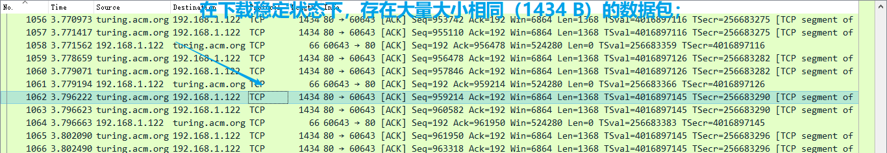

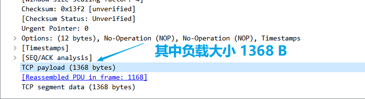

由图可知，TCP载荷部分的大小为$1368\ bytes$，而整个数据包的大小为$1434\ bytes$，因此，TCP载荷部分占整个数据包的比例为：$1368/1434=95.4\%$。

## 问题3：TCP连接上传速率

*What is the rough data rate in the upload direction in packets/second and bits/second due to the ACK packets?*

在Wireshark中使用I/O Graphs功能，在过滤器中添加`tcp.dstport==80`，绘制TCP连接下载速度的折线图如下所示。

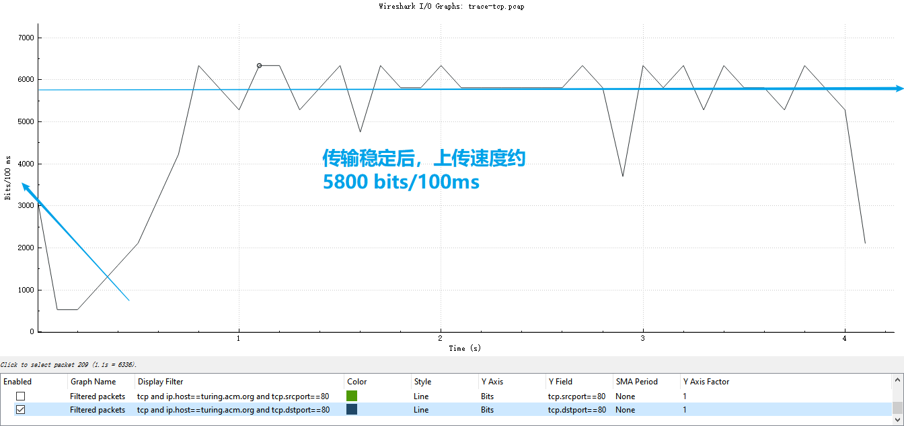

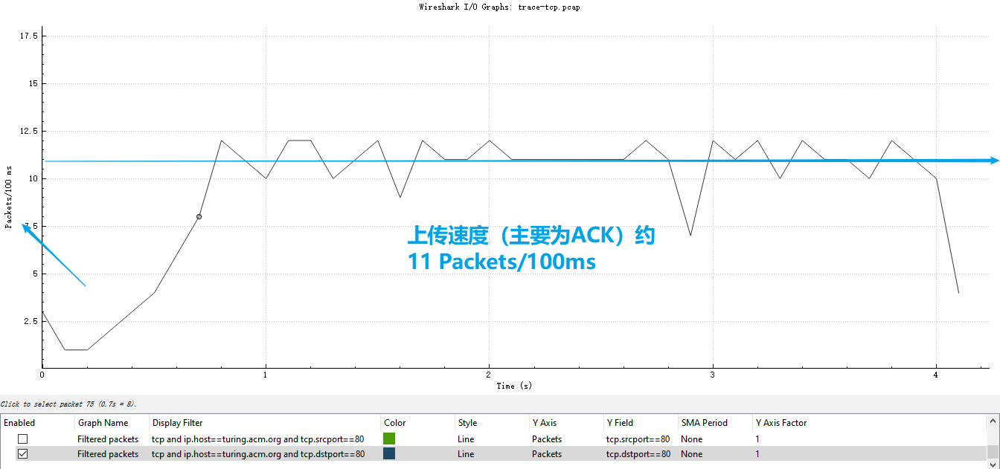

由图可知，TCP连接下载速度的大致数据率为：$110\ packets/second$和$5.8 \times 10^{4}\ bits/second$。

## 问题4： TCP 中Seq与Ack关系

*If the most recently received TCP segment from the server has a sequence number of X, then what ACK number does the next transmitted TCP segment carry?*

如果最近接收到的服务器发送的TPC段的$Seq=X$，此TCP段的负载大小为$D Bytes$，则接下来客户端返回的$ACK=X+D$。

注意，这里D为TCP段的负载大小，而不是整个TCP段的大小。

例如在本实验中，传输中间部分前后的接收和返回如图所示，其中$407910 + 1368 = 409278$。
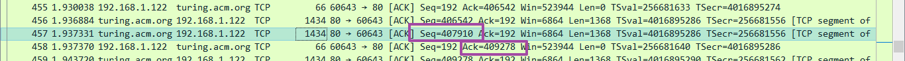


