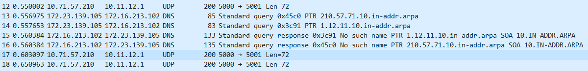
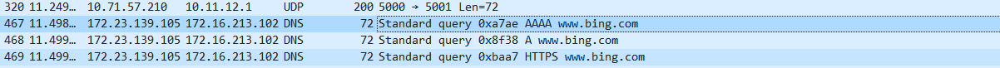
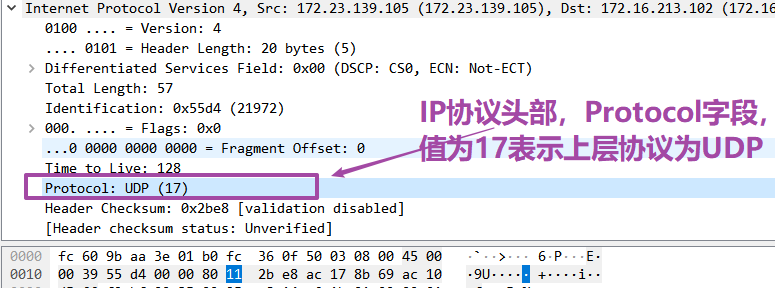
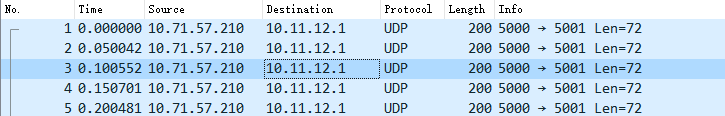
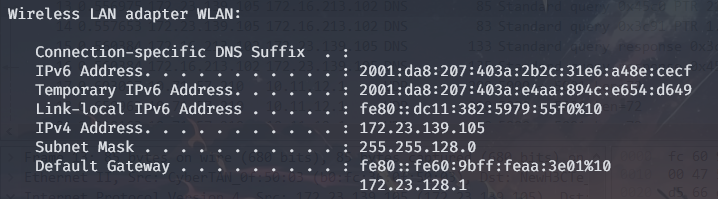

<!DOCTYPE html>
<html lang="en">
<head>
    <meta charset="UTF-8">
    <meta name="viewport" content="width=device-width, initial-scale=1.0">
    <title>实验报告封面</title>
    <style>
        .cover {
            font-family: 华文楷体, sans-serif;
            font-size: 18pt;
            margin-top: 0px;
            padding: 0;
            display: flex;
            align-items: center;
            justify-content: center;
            min-height: 100vh;
            /* page-break-before: auto;  或者直接删除这行 */
        }
        .cover #cover {
            text-align: center;
            position: relative;
        }
        .cover #logo {
            max-width: 100%;
            margin: 40px auto;
            display: block;
        }
        .cover #course {
            font-family: "华文行楷", sans-serif;
            font-size: 64px;
            margin: 20px;
            line-height: 1.3;
        }
        .cover #experiment {
            font-family: "华文楷体", sans-serif;
            font-size: 40px;
            margin: 30px 0;
        }
        .cover #info {
            text-align: center;
            margin: 20px;
            margin-top: 120px;
            position: relative;
        }
        .cover #info span {
            display: inline-block;
            text-align: left;
        }
        .cover #info span.label {
            font-family: "华文楷体", sans-serif;
            font-size: 22px;
            width: 100px;
        }
        .cover #info span.line {
            border-bottom: 1px solid #000;
            width: 150px;
            margin-bottom: -2pt;
            margin-left: -50px;
            display: inline-block;
            position: relative;
        }
        .cover #info span.text {
            position: absolute;
            font-family: "华文楷体", sans-serif;
            font-size: 22px;
            top: -16pt;
            left: 0;
            right: 0;
            text-align: center;
        }
    </style>
</head>
<body>
    <div class="cover">
        <div id="cover">
                        <div id="course">计算机网络<br/>实验报告</div>
            <div id="experiment">Lab4  UDP</div>
            <div id="info">
                <span class="label">姓名：</span>
                <span class="line">
                    <span class="text">O2iginal</span>
                </span><br>
                <span class="label">学号：</span>
                <span class="line">
                    <span class="text">O2iginal ID</span>
                </span><br>
                <span class="label">日期：</span>
                <span class="line">
                    <span class="text">2023-11-15</span>
                </span>
            </div>
        </div>
    </div>
</body>
</html>


<div>
    <div style="width:80px;float:left; font-family:方正公文黑体;">
        实验目的：
    </div>
    <div style="overflow:hidden; font-family:华文楷体;">
        通过WireShark抓包分析UDP协议的报文结构和使用方法。
    </div>
    <div style="width:80px;float:left; font-family:方正公文黑体;">
        实验环境：
    </div>
    <div style="overflow:hidden; font-family:华文楷体;">
        WireShark；ipconfig；Browser
    </div>
</div>
<hr>
<center>
    <b>
        <h1>实验报告目录</h1>
    </b>
</center>


[TOC]

# Step 1: Capture a Trace

使用WireShark抓包，查看UDP协议的报文结构和使用方法。由于UDP广泛用于很多应用程序，因此仅仅监听后台UDP流量即可获得一定数据包。

此外，UDP用于DNS查询，因此通过访问网站来捕获DNS查询的数据包。

总结，本次实验捕获了UDP协议的数据包，其中包括DNS查询的数据包和其他后台应用程序的数据包。

过滤器设置为`udp`，捕获到的数据包如下图所示：





# Step 2: Inspect the Trace

查看捕获到的UDP数据包的UDP段头部，如下所示：
```sh
User Datagram Protocol, Src Port: 63935, Dst Port: 53
    Source Port: 63935
    Destination Port: 53
    Length: 37
    Checksum: 0xc814 [unverified]
    [Checksum Status: Unverified]
    [Stream index: 5]
    [Timestamps]
    UDP payload (29 bytes)
```

其中，
- `Source Port`和`Destination Port`分别表示源端口和目的端口，用于标识发送方和接收方的应用程序。
- `Length`表示UDP数据报的长度，包括首部和数据部分。
- `Checksum`表示校验和，用于检测UDP数据报在传输过程中是否出错。
- `UDP payload`表示UDP数据报的数据部分。


# Step 3: UDP Message Structure

## 绘图： UDP数据包结构图

*To check your understanding of UDP, sketch a figure of the UDP message structure as you observed. It should show the position of the IP header, UDP header, and UDP payload.*

UDP数据包结构图如下所示：


## 问题1：Length长度字段含义

*What does the Length field include? The UDP payload, UDP payload and UDP header, or UDP payload, UDP header, and lower layer headers?*

**答：**Length字段包括UDP数据报的长度，包括首部和数据部分。

例如，上述捕获到的数据包的Length字段为37，而UDP payload字段为29，因此UDP首部的长度为8字节。

##  问题2：Checksum校验和字段位数

*How long in bits is the UDP checksum?*

**答：**UDP校验和字段为16位。

## 问题3：整个UDP头部长度

*How long in bytes is the entire UDP header?*

**答：**UDP头部长度为8字节。

# Step 4: UDP Usage

## 问题1：IP头部表面上层协议类型的字段

*Give the value of the IP Protocol field that identifies the upper layer protocol as UDP.*

**答：**IP头部表面上层协议类型的字段为17，表示UDP。

如下图所示：


## 问题2：源与目标均不是本机IP地址的UDP数据包

*Examine the UDP messages and give the destination IP addresses that are used when your computer is neither the source IP address nor the destination IP address.*

在本次实验抓包中，有大量相同的源与目标均不是本机IP地址的UDP数据包，如下所示：


其源IP地址为`10.71.57.210`，目的IP地址为`10.11.12.1`，均不是本机IP地址。

而本机IP地址为`172.23.139.105`，如下图所示：



## 问题3：UDP消息的典型大小

*What is the typical size of UDP messages in your trace?*

**答：**本次实验抓包中，UDP消息的典型大小几十到几百字节。

例如：
- 对于`www.bing.com`的DNS查询，UDP负载大小为30B；
- 对于`static.ce-cdn.net`的DNS查询，UDP负载大小为35B；
- 对于`godbolt.org`的DNS查询，UDP负载大小为32B；
- 对于`www.bing.com`的DNS查询的回复，UDP负载大小为238B；
- 对于`static.ce-cdn.net`的DNS查询的回复，UDP负载大小为262B；
- 对于`godbolt.org`的DNS查询的回复，UDP负载大小为256B；


