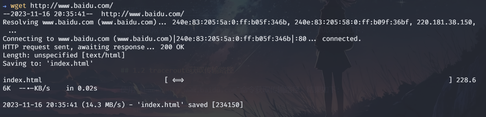
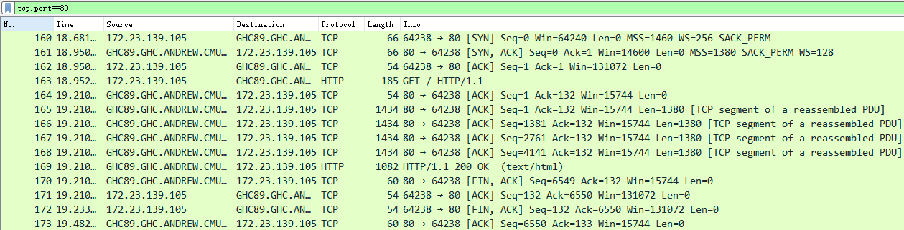
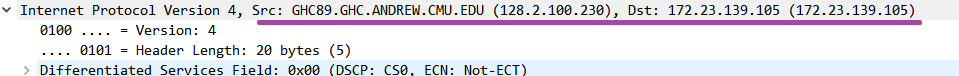
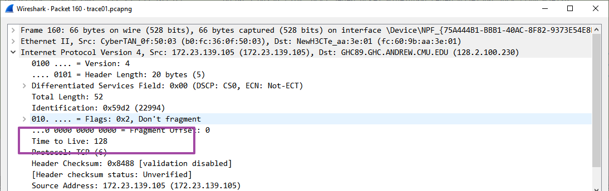
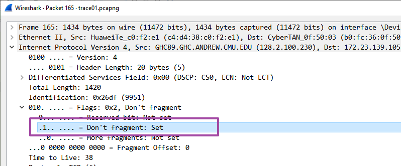
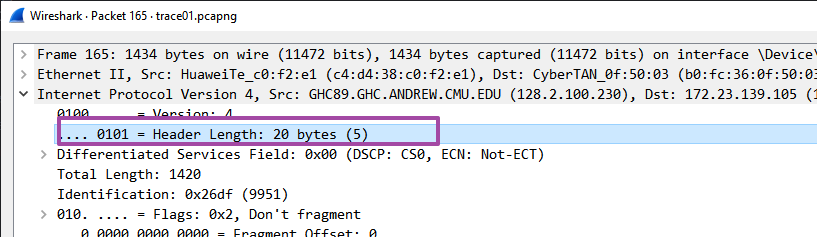
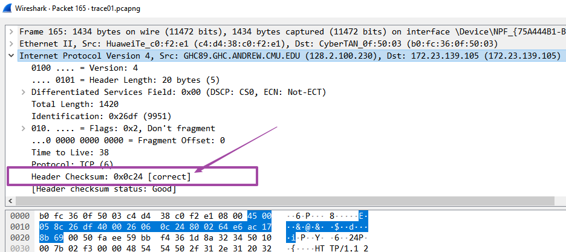

<!DOCTYPE html>
<html lang="en">
<head>
    <meta charset="UTF-8">
    <meta name="viewport" content="width=device-width, initial-scale=1.0">
    <title>实验报告封面</title>
    <style>
        .cover {
            font-family: 华文楷体, sans-serif;
            font-size: 18pt;
            margin-top: 0px;
            padding: 0;
            display: flex;
            align-items: center;
            justify-content: center;
            min-height: 100vh;
            /* page-break-before: auto;  或者直接删除这行 */
        }
        .cover #cover {
            text-align: center;
            position: relative;
        }
        .cover #logo {
            max-width: 100%;
            margin: 40px auto;
            display: block;
        }
        .cover #course {
            font-family: "华文行楷", sans-serif;
            font-size: 64px;
            margin: 20px;
            line-height: 1.3;
        }
        .cover #experiment {
            font-family: "华文楷体", sans-serif;
            font-size: 40px;
            margin: 30px 0;
        }
        .cover #info {
            text-align: center;
            margin: 20px;
            margin-top: 120px;
            position: relative;
        }
        .cover #info span {
            display: inline-block;
            text-align: left;
        }
        .cover #info span.label {
            font-family: "华文楷体", sans-serif;
            font-size: 22px;
            width: 100px;
        }
        .cover #info span.line {
            border-bottom: 1px solid #000;
            width: 150px;
            margin-bottom: -2pt;
            margin-left: -50px;
            display: inline-block;
            position: relative;
        }
        .cover #info span.text {
            position: absolute;
            font-family: "华文楷体", sans-serif;
            font-size: 22px;
            top: -16pt;
            left: 0;
            right: 0;
            text-align: center;
        }
    </style>
</head>
<body>
    <div class="cover">
        <div id="cover">
                        <div id="course">计算机网络<br/>实验报告</div>
            <div id="experiment">Lab5  IPv4</div>
            <div id="info">
                <span class="label">姓名：</span>
                <span class="line">
                    <span class="text">O2iginal</span>
                </span><br>
                <span class="label">学号：</span>
                <span class="line">
                    <span class="text">O2iginal ID</span>
                </span><br>
                <span class="label">日期：</span>
                <span class="line">
                    <span class="text">2023-11-16</span>
                </span>
            </div>
        </div>
    </div>
</body>
</html>


<div>
    <div style="width:80px;float:left; font-family:方正公文黑体;">
        实验目的：
    </div>
    <div style="overflow:hidden; font-family:华文楷体;">
        通过WireShark抓包了解IP协议。
    </div>
    <div style="width:80px;float:left; font-family:方正公文黑体;">
        实验环境：
    </div>
    <div style="overflow:hidden; font-family:华文楷体;">
        WireShark；wget/curl；traceroute/tracert；
    </div>
</div>
<hr>
<center>
    <b>
        <h1>实验报告目录</h1>
    </b>
</center>

[TOC]

# Step 1: Capture a Trace

## 1.1 wget获取文件

选择`http://csapp.cs.cmu.edu/`。

wget抓取网页的命令为`wget http://csapp.cs.cmu.edu/`，抓取结果如下：



## 1.2 traceroute获取传输路径

使用`traceroute csapp.cs.cmu.edu`命令获取传输路径，结果如下：

```sh
$ tracert csapp.cs.cmu.edu

Tracing route to csapptest.cs.cmu.edu [128.2.100.230]
over a maximum of 30 hops:

  1     *        *        *     Request timed out.
  2     4 ms     2 ms     3 ms  172.19.251.13
  3     5 ms     3 ms     3 ms  172.16.201.66
  4     *        *        *     Request timed out.
  5    11 ms     5 ms     4 ms  202.112.42.17
  6     4 ms     5 ms     4 ms  101.4.113.66
  7     *        *        *     Request timed out.
  8     *        *        *     Request timed out.
  9     4 ms     4 ms     3 ms  210.25.189.237
 10     5 ms     6 ms     4 ms  210.25.187.50
 11    10 ms     3 ms     3 ms  210.25.187.41
 12   175 ms   173 ms   173 ms  210.25.189.50
 13   184 ms   188 ms   173 ms  210.25.189.134
 14   234 ms   234 ms   235 ms  fourhundredge-0-0-0-2.4079.core2.salt.net.internet2.edu [163.253.1.115]
 15   241 ms   233 ms   237 ms  fourhundredge-0-0-0-23.4079.core1.salt.net.internet2.edu [163.253.1.32]
 16   235 ms   232 ms   235 ms  fourhundredge-0-0-0-0.4079.core1.denv.net.internet2.edu [163.253.1.170]
 17   235 ms   238 ms   238 ms  fourhundredge-0-0-0-0.4079.core1.kans.net.internet2.edu [163.253.1.243]
 18   236 ms   234 ms   233 ms  fourhundredge-0-0-0-3.4079.core2.chic.net.internet2.edu [163.253.1.244]
 19   235 ms   235 ms   235 ms  fourhundredge-0-0-0-3.4079.core2.eqch.net.internet2.edu [163.253.2.19]
 20   236 ms   240 ms   235 ms  fourhundredge-0-0-0-0.4079.core2.clev.net.internet2.edu [163.253.2.16]
 21   236 ms   237 ms   238 ms  fourhundredge-0-0-0-3.4079.core2.ashb.net.internet2.edu [163.253.1.138]
 22   240 ms   235 ms   240 ms  fourhundredge-0-0-0-1.4079.core1.phil.net.internet2.edu [163.253.1.137]
 23   242 ms   232 ms   235 ms  163.253.5.33
 24     *        *        *     Request timed out.
 25   252 ms   258 ms   254 ms  CORE0-POD-I-DCNS-8500.GW.CMU.NET [128.2.0.181]
 26   242 ms   243 ms   245 ms  POD-E-CORE0.GW.CMU.NET [128.2.0.162]
 27   243 ms   242 ms   243 ms  GHC89.GHC.ANDREW.CMU.EDU [128.2.100.230]

Trace complete.
```

## 1.3 WireShark抓包

抓取前准备：
1. 设置过滤器为`tcp.port==80`;
2. 打开`network name resolution`选项；
3. 关闭`capture packets in promiscuous mode`选项；

再次使用`wget http://csapp.cs.cmu.edu/`命令抓取网页，抓包结果如下：




# Step 2: Inspect the Trace

选择Wireshark抓取的其中一个包，查看IP头部，结果如下：

```sh
Internet Protocol Version 4, Src: GHC89.GHC.ANDREW.CMU.EDU (128.2.100.230), Dst: 172.23.139.105 (172.23.139.105)
    0100 .... = Version: 4
    .... 0101 = Header Length: 20 bytes (5)
    Differentiated Services Field: 0x00 (DSCP: CS0, ECN: Not-ECT)
    Total Length: 1420
    Identification: 0x26df (9951)
    010. .... = Flags: 0x2, Don't fragment
    ...0 0000 0000 0000 = Fragment Offset: 0
    Time to Live: 38
    Protocol: TCP (6)
    Header Checksum: 0x0c24 [validation disabled]
    [Header checksum status: Unverified]
    Source Address: GHC89.GHC.ANDREW.CMU.EDU (128.2.100.230)
    Destination Address: 172.23.139.105 (172.23.139.105)
```

其中，
- `Version`为4，表示为IPv4；（**字段长**4bit）
- `Header Length`为20，表示头部长度为20字节；（**字段长**4bit）
- `Differentiated Services Field`为0x00，表示服务类型为CS0，ECN为Not-ECT；（**字段长**8bit）
- `Total Length`为1420，表示总长度为1420字节；（**字段长**16bit）
- `Identification`为0x26df，表示标识符为9951；（**字段长**16bit）
- `Flags`为0x2，表示不分片；（**字段长**3bit）
- `Fragment Offset`为0，表示分片偏移为0；（**字段长**13bit）
- `Time to Live`为38，表示生存时间为38；（**字段长**8bit）
- `Protocol`为6，表示上层协议为TCP；（**字段长**8bit）
- `Header Checksum`为0x0c24，表示头部校验和为0x0c24；（**字段长**16bit）
- `Source Address`为GHC89.GHC.ANDREW.CMU.EDU (128.2.100.230)，表示源地址为 128.2.100.230；（**字段长**32bit）
- `Destination Address`为172.23.139.105，表示目的地址为172.23.139.105；（**字段长**32bit）

# Step 3: IP Packet Structure

## 绘制IP头部结构图

绘制IP头部结构图如下：


## 问题1：本机与服务器的IP地址

- 本机的IP地址为`172.23.139.105`；
- 服务器的IP地址为`128.2.100.230`；



## 问题2：IP数据报的总长度

Total Length字段包括IP头部和IP负载，表示IP数据包（头部+负载）的总大小，以字节为单位。

在上述抓包结果中，Total Length字段为1420，表示IP数据包的总长度为1420字节。
IP头部总长为 4+4+8+16+16+3+13+8+8+16+32+32=160bit=20B，IP负载总长为1420-20=1400字节。

## 问题3：Identification字段数值

Identification字段用于唯一标识主机发送的每一个数据报，用于数据报的重组。
- 同一个主机发送的每个数据报的Identification字段数值都不同。
- 由Wireshark抓包结果可知，同一主机发送的多个数据报的Identification字段数值连续递增，即每个数据报的Identification字段数值为上一个数据报的Identification字段数值加1。
  - 对于本机发送的数据报，Identification字段数值从最初建立连接请求的22994开始，逐次连续递增，增加至最后的22998；
  - 对于服务器发送的数据报，Identification字段，在第一个数据报（SYN ACK）中数值为0，下一个为9950，而后逐次连续递增，增加至最后连接拆除时的9957.

## 问题4：本机发送的数据包的TTL值

- 本机发送的数据包的TTL值均为128；
- 128并不是最大TTL值，因TTL值的最大值为255（即二进制下的11111111，而128的二进制表示为10000000）。

本机发送的数据包的TTL值均为128，如下图所示：


## 问题5：如何判断数据包是否被分段

确定数据包是否未被分段：检查IP头部中的Flags字段。
- 如果“不分段”（DF）标志被设置，这意味着在其传输过程中数据包不应被分段；
- 如果“更多分段”（MF）标志被设置，这意味着数据包是分段的一部分，而且还有更多的分段；

如下图所示的抓包得到的数据包中，Flags字段为0x2，表示不分段。


## 问题6：IP头部长度如何确定

- IP头部的长度由Header Length字段确定。
- 编码方式：Header Length字段是一个4位字段，它指定头部中32位字的数量。
- 在下图数据包中，Header Length字段的值为5，表示头部长度为5*32=160bit=20B。



# Step 4: Internet Paths

绘制本机到服务器的路径图。


本机IP地址为`172.23.139.105`，traceroute结果如下：

```sh
$ tracert csapp.cs.cmu.edu

Tracing route to csapptest.cs.cmu.edu [128.2.100.230]
over a maximum of 30 hops:

  1     *        *        *     Request timed out.
  2     4 ms     2 ms     3 ms  172.19.251.13
  3     5 ms     3 ms     3 ms  172.16.201.66
  4     *        *        *     Request timed out.
  5    11 ms     5 ms     4 ms  202.112.42.17
  6     4 ms     5 ms     4 ms  101.4.113.66
  7     *        *        *     Request timed out.
  8     *        *        *     Request timed out.
  9     4 ms     4 ms     3 ms  210.25.189.237
 10     5 ms     6 ms     4 ms  210.25.187.50
 11    10 ms     3 ms     3 ms  210.25.187.41
 12   175 ms   173 ms   173 ms  210.25.189.50
 13   184 ms   188 ms   173 ms  210.25.189.134
 14   234 ms   234 ms   235 ms  fourhundredge-0-0-0-2.4079.core2.salt.net.internet2.edu [163.253.1.115]
 15   241 ms   233 ms   237 ms  fourhundredge-0-0-0-23.4079.core1.salt.net.internet2.edu [163.253.1.32]
 16   235 ms   232 ms   235 ms  fourhundredge-0-0-0-0.4079.core1.denv.net.internet2.edu [163.253.1.170]
 17   235 ms   238 ms   238 ms  fourhundredge-0-0-0-0.4079.core1.kans.net.internet2.edu [163.253.1.243]
 18   236 ms   234 ms   233 ms  fourhundredge-0-0-0-3.4079.core2.chic.net.internet2.edu [163.253.1.244]
 19   235 ms   235 ms   235 ms  fourhundredge-0-0-0-3.4079.core2.eqch.net.internet2.edu [163.253.2.19]
 20   236 ms   240 ms   235 ms  fourhundredge-0-0-0-0.4079.core2.clev.net.internet2.edu [163.253.2.16]
 21   236 ms   237 ms   238 ms  fourhundredge-0-0-0-3.4079.core2.ashb.net.internet2.edu [163.253.1.138]
 22   240 ms   235 ms   240 ms  fourhundredge-0-0-0-1.4079.core1.phil.net.internet2.edu [163.253.1.137]
 23   242 ms   232 ms   235 ms  163.253.5.33
 24     *        *        *     Request timed out.
 25   252 ms   258 ms   254 ms  CORE0-POD-I-DCNS-8500.GW.CMU.NET [128.2.0.181]
 26   242 ms   243 ms   245 ms  POD-E-CORE0.GW.CMU.NET [128.2.0.162]
 27   243 ms   242 ms   243 ms  GHC89.GHC.ANDREW.CMU.EDU [128.2.100.230]

Trace complete.
```

# Step 5: IP Header Checksum

选择一个数据包，其20B的IP头部16进制值如下：
```txt
4500058c26df400026060c24800264e6ac178b69
```

将之拆分成10个16位的字段，如下：
```txt
4500 058c 26df 4000 2606 0c24 8002 64e6 ac17 8b69
```

将这10个字段相加，如下：
```txt
4500 + 058c + 26df + 4000 + 2606 + 0c24 + 8002 + 64e6 + ac17 + 8b69 = 2FFFD
```

计算1的补码总和:
```txt
FFFD + (2FFFD >> 16) = FFFD + 0002 = FFFF
```

0xffff在1的补码形式中是零，因此，该数据包的IP头部校验和验证正确。

查看WireShark抓包的Checksum字段，如下图所示，与计算结果一致（correct）。




