<!DOCTYPE html>
<html lang="en">
<head>
    <meta charset="UTF-8">
    <meta name="viewport" content="width=device-width, initial-scale=1.0">
    <title>实验报告封面</title>
    <style>
        .cover {
            font-family: 华文楷体, sans-serif;
            font-size: 18pt;
            margin-top: 0px;
            padding: 0;
            display: flex;
            align-items: center;
            justify-content: center;
            min-height: 100vh;
            /* page-break-before: auto;  或者直接删除这行 */
        }
        .cover #cover {
            text-align: center;
            position: relative;
        }
        .cover #logo {
            max-width: 100%;
            margin: 40px auto;
            display: block;
        }
        .cover #course {
            font-family: "华文行楷", sans-serif;
            font-size: 64px;
            margin: 20px;
            line-height: 1.3;
        }
        .cover #experiment {
            font-family: "华文楷体", sans-serif;
            font-size: 40px;
            margin: 30px 0;
        }
        .cover #info {
            text-align: center;
            margin: 20px;
            margin-top: 120px;
            position: relative;
        }
        .cover #info span {
            display: inline-block;
            text-align: left;
        }
        .cover #info span.label {
            font-family: "华文楷体", sans-serif;
            font-size: 22px;
            width: 100px;
        }
        .cover #info span.line {
            border-bottom: 1px solid #000;
            width: 150px;
            margin-bottom: -2pt;
            margin-left: -50px;
            display: inline-block;
            position: relative;
        }
        .cover #info span.text {
            position: absolute;
            font-family: "华文楷体", sans-serif;
            font-size: 22px;
            top: -16pt;
            left: 0;
            right: 0;
            text-align: center;
        }
    </style>
</head>
<body>
    <div class="cover">
        <div id="cover">
                        <div id="course">计算机网络<br/>实验报告</div>
            <div id="experiment">Lab6  ICMP</div>
            <div id="info">
                <span class="label">姓名：</span>
                <span class="line">
                    <span class="text">O2iginal</span>
                </span><br>
                <span class="label">学号：</span>
                <span class="line">
                    <span class="text">O2iginal ID</span>
                </span><br>
                <span class="label">日期：</span>
                <span class="line">
                    <span class="text">2023-11-17</span>
                </span>
            </div>
        </div>
    </div>
</body>
</html>


<div>
    <div style="width:80px;float:left; font-family:方正公文黑体;">
        实验目的：
    </div>
    <div style="overflow:hidden; font-family:华文楷体;">
        了解 ICMP (Internet Control Message Protocol) 协议的使用。
    </div>
    <div style="width:80px;float:left; font-family:方正公文黑体;">
        实验环境：
    </div>
    <div style="overflow:hidden; font-family:华文楷体;">
        WireShark；traceroute/tracert；ping；
    </div>
</div>
<hr>
<center>
    <b>
        <h1>实验报告目录</h1>
    </b>
</center>


[TOC]

# Step 1: Capture a Trace

## 1.1 ping 测试

选择`www5.baidu.com`进行本次实验。

使用命令`ping www5.baidu.com`进行ping操作，结果如下：

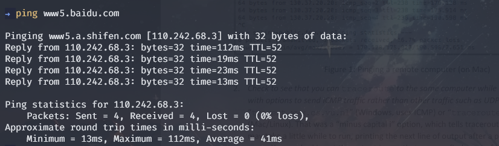

## 1.2 traceroute 测试

使用命令`traceroute www5.baidu.com`进行traceroute操作，结果如下：

```
$ tracert www5.baidu.com

Tracing route to www5.a.shifen.com [110.242.68.3]
over a maximum of 30 hops:

  1     *        *        *     Request timed out.
  2     9 ms     8 ms     5 ms  172.19.251.13
  3     9 ms     6 ms     5 ms  172.16.201.66
  4     8 ms     5 ms    70 ms  61.49.176.89
  5     *        *        *     Request timed out.
  6    27 ms    10 ms    28 ms  124.65.194.33
  7     *        *        *     Request timed out.
  8    21 ms    14 ms    56 ms  110.242.66.178
  9    45 ms    47 ms    15 ms  221.194.45.134
 10     *        *        *     Request timed out.
 11     *        *        *     Request timed out.
 12     *        *        *     Request timed out.
 13    16 ms    12 ms    12 ms  110.242.68.3

Trace complete.
```

## 1.3 Wireshark 抓包

抓包前Wireshark设置如下：
- 设置过滤器为`icmp`，只抓取icmp协议的包；
- 开启`Name Resolution`，将IP地址解析为域名；
- 关闭`capture packets in promiscuous mode`；

打开Wireshark开始抓包，再次进行ping和traceroute操作，抓抱结果如下：

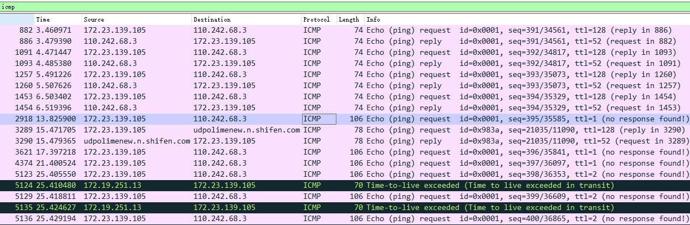


# Step 2: Echo (ping) Packets

## 查看ICMP协议的报文格式

选择第一个ICMP请求报文，查看其报文格式，如下所示：

```sh
Internet Control Message Protocol
    Type: 8 (Echo (ping) request)
    Code: 0
    Checksum: 0x4bd4 [correct]
    [Checksum Status: Good]
    Identifier (BE): 1 (0x0001)
    Identifier (LE): 256 (0x0100)
    Sequence Number (BE): 391 (0x0187)
    Sequence Number (LE): 34561 (0x8701)
    [Response frame: 886]
    Data (32 bytes)
```

其中，
- Type: 8 (Echo (ping) request) 表示该报文为ping请求报文；
- Code: 0 表示该报文为ping请求报文；
- Checksum: 0x4bd4 [correct] 表示该报文的校验和正确；
- Identifier (BE): 1 (0x0001) 表示该报文的标识符（大端表示）为1；
- Identifier (LE): 256 (0x0100) 表示该报文的标识符（小端表示）为256；
- Sequence Number (BE): 391 (0x0187) 表示该报文的序列号（大端表示）为391；
- Sequence Number (LE): 34561 (0x8701) 表示该报文的序列号（小端表示）为34561；
- Data (32 bytes) 表示该报文的数据部分为32字节；

上述报文的回复报文如下：

```sh
Internet Control Message Protocol
    Type: 0 (Echo (ping) reply)
    Code: 0
    Checksum: 0x53d4 [correct]
    [Checksum Status: Good]
    Identifier (BE): 1 (0x0001)
    Identifier (LE): 256 (0x0100)
    Sequence Number (BE): 391 (0x0187)
    Sequence Number (LE): 34561 (0x8701)
    [Request frame: 882]
    [Response time: 18.419 ms]
    Data (32 bytes)
```

## 问题1：ICMP的echo请求和回复的类型码值

*What are the Type/Code values for an ICMP echo request and echo reply packet,respectively?*

**答：**
- echo请求的类型码值为8；
- echo回复的类型码值为0；

如下图所示：

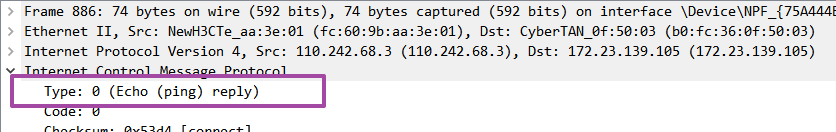

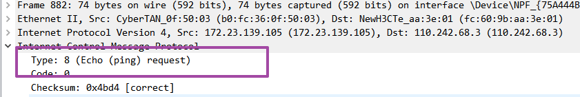

## 问题2：echo请求和回复的标识符和序列号

*How do the Identifier and Sequence Number compare for an echo request and the corresponding  echo reply?*

**答：**
- echo请求和回复的标识符相同；
- echo请求和回复的序列号相同；

## 问题3：连续的echo请求的标识符和序列号

*How do the Identifier and Sequence Number compare for successive echo request packets?*

**答：**
- 连续的echo请求的标识符相同；
- 连续的echo请求的序列号连续递增；

## 问题4：echo请求和回复的数据部分

*Is the data in the echo reply the same as in the echo request or different?*

**答：**echo请求和回复的数据部分相同；


如下图所示，echo请求和回复的数据部分均为
`6162636465666768696a6b6c6d6e6f7071727374757677616263646566676869`


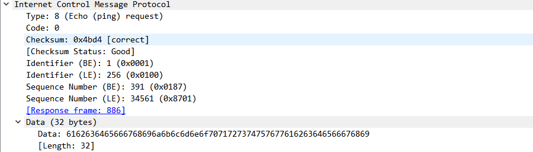

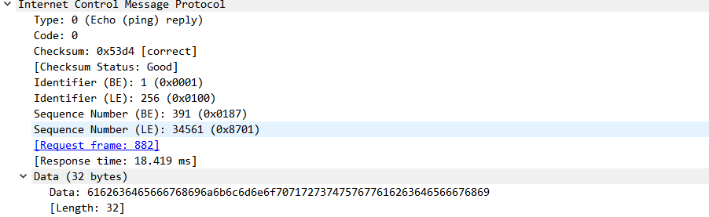

# Step 3: TTL Exceeded (traceroute) Packets

## 绘制TLL Exceeded报文的结构

选择第一个TTL Exceeded数据包，绘制其结构如下图所示：


可见，ICMP TTL Exceeded 用于指示数据包在转发过程中 TTL 耗尽。此报文包含了触发 TTL 耗尽的数据包的一部分，以便源主机能够了解 TTL 耗尽的路由路径。ICMP TTL Exceeded 报文的负载中嵌套了原始的 IP 标头，显示了数据包的源地址和目标地址，帮助源主机识别哪个路由器上 TTL 耗尽了。在这种情况下，嵌套的 ICMP Echo 请求报文提供了触发 TTL 耗尽的上下文信息。

## 问题1：TTL Exceeded报文的类型码值

*What is the Type/Code value for an ICMP TTL Exceeded packet?*

**答：**
- TTL Exceeded报文的类型码值为11；
- 表示该报文为TTL Exceeded报文；

## 问题2：如何确定不同ICMP报文格式

*Say how the receiver can safely find and process all the ICMP fields if it does not know ahead of time what kind of ICMP message to expect. The potential issue, as you have probably noticed, is that different ICMP messages can have different formats. For instance, Echo has Sequence and  Identifier fields while TTL Exceeded does not.*

**答：**
- ICMP报文的类型码值可以用于确定不同ICMP报文的格式；
- 由于ICMP报文类型字段在ICMP报文中的位置靠前且固定，当报文格式不同时，可以通过类型码值来确定不同ICMP报文的格式；
- 例如，TTL Exceeded报文的类型码值为11，而Echo报文的类型码值为8，因此可以通过类型码值来确定不同ICMP报文的格式；

## 问题3：TTL Exceeded报文的ICMP头部长度

*How long is the ICMP header of a TTL Exceeded packet? Select different parts of the header in Wireshark to see how they correspond to the bytes in the packet.*

**答：**

- TTL Exceeded报文的ICMP头部长度为8字节；
- 包含Type、Code、Checksum、Unused 4个字段；
  - Type：1字节；
  - Code：1字节；
  - Checksum：2字节；
  - Unused：4字节；

## 问题4：ICMP负载中的TTL值

*The ICMP payload contains an IP header. What is the TTL value in this header? Explain why it has  this value. Guess what it will be before you look!*

- TTL值为1；
- 原因：TTL值为1，表示该数据包在转发过程中 TTL 耗尽；因此该数据包被丢弃，ICMP TTL Exceeded 报文被发送回源主机；

如下图所示：
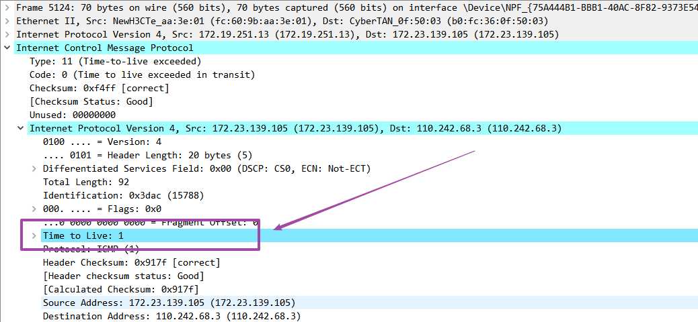

# Step 4: Internet Paths

## 问题1：本机如何从TTL Exceeded报文获取路由器IP地址

*How does your computer (the source) learn the IP address of a router along the path from a TTL exceeded packet? Say where on this packet the IP address is found.*

**答：**
- 本机从TTL Exceeded报文的ICMP负载的IP头部获取路由器的IP地址；
- ICMP TTL Exceeded 报文的负载中嵌套了原始的 IP 标头，显示了数据包的源地址和目标地址，使得源主机可从中得知 TTL 耗尽的路由器IP地址。

如下图所示，为TTL Exceeded报文的ICMP负载的IP头部，其中包含了路由器的IP地址：

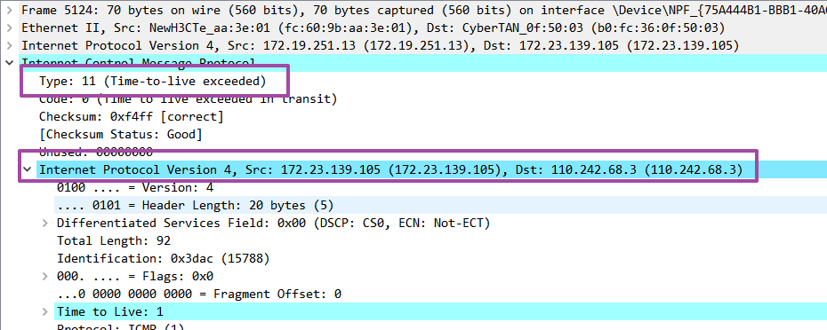

## 问题2：traceroute向每个路由器发送探测报文数

*How many times is each router along the path probed by traceroute? Look at the TTL Exceeded responses and see if you can discern a pattern.*

**答：**traceroute默认向每个路由器发送3次探测报文；

如下图所示，在Wireshark中过滤查看traceroute输出的每个路由器的IP，发现抓包结构中每个路由器的IP均出现了3次，因此traceroute默认向每个路由器发送3次探测报文：

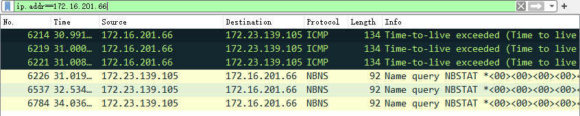

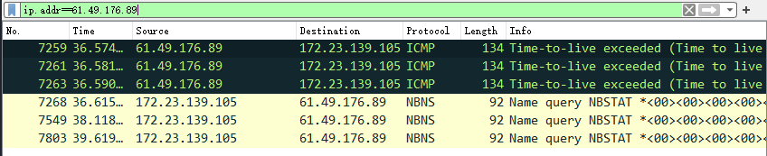

## 问题3：traceroute如何逐渐测试路径上更远的路由器

*How does your computer (the source) craft an echo request packet to find (by eliciting a TTL Exceeded response) the router N hops along the path towards the destination?*

**答：**
- 源主机通过构建具有逐渐增加 TTL 值的回显请求数据包来找到沿路径的第 N 个路由器；
- 回显请求数据包的 TTL 字段开始时设置为 1，然后逐步递增。当 TTL 达到 N 时，目标路由器将返回 TTL 耗尽的响应，源主机通过解析响应中的 IP 头来确定该路由器的 IP 地址；
- 关键属性即为逐渐增加的 TTL；

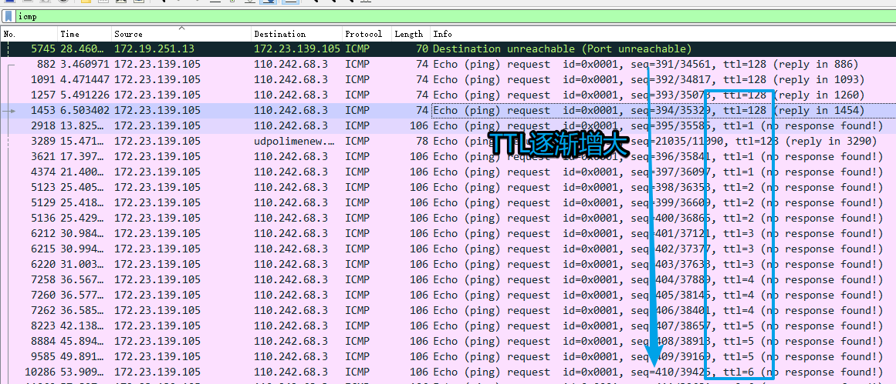


## 绘制网络路径图

使用traceroute的输出结果，绘制网络路径图如下所示：


对应的traceroute的输出结果如下：

```
$ tracert www5.baidu.com

Tracing route to www5.a.shifen.com [110.242.68.3]
over a maximum of 30 hops:

  1     *        *        *     Request timed out.
  2     9 ms     8 ms     5 ms  172.19.251.13
  3     9 ms     6 ms     5 ms  172.16.201.66
  4     8 ms     5 ms    70 ms  61.49.176.89
  5     *        *        *     Request timed out.
  6    27 ms    10 ms    28 ms  124.65.194.33
  7     *        *        *     Request timed out.
  8    21 ms    14 ms    56 ms  110.242.66.178
  9    45 ms    47 ms    15 ms  221.194.45.134
 10     *        *        *     Request timed out.
 11     *        *        *     Request timed out.
 12     *        *        *     Request timed out.
 13    16 ms    12 ms    12 ms  110.242.68.3
```