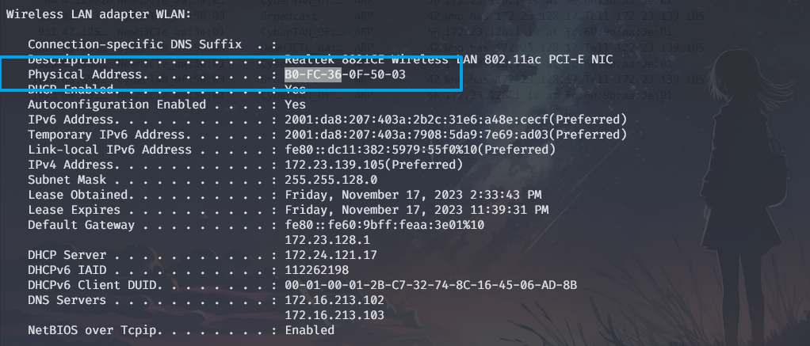
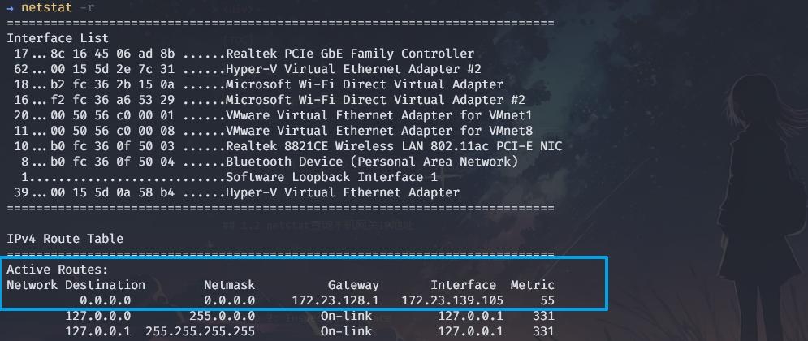
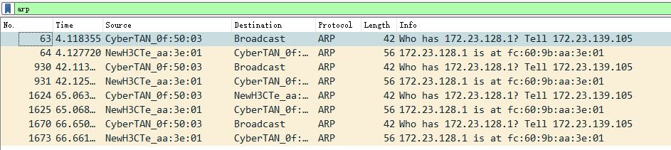
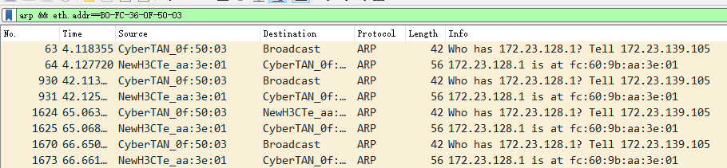

<!DOCTYPE html>
<html lang="en">
<head>
    <meta charset="UTF-8">
    <meta name="viewport" content="width=device-width, initial-scale=1.0">
    <title>实验报告封面</title>
    <style>
        .cover {
            font-family: 华文楷体, sans-serif;
            font-size: 18pt;
            margin-top: 0px;
            padding: 0;
            display: flex;
            align-items: center;
            justify-content: center;
            min-height: 100vh;
            /* page-break-before: auto;  或者直接删除这行 */
        }
        .cover #cover {
            text-align: center;
            position: relative;
        }
        .cover #logo {
            max-width: 100%;
            margin: 40px auto;
            display: block;
        }
        .cover #course {
            font-family: "华文行楷", sans-serif;
            font-size: 64px;
            margin: 20px;
            line-height: 1.3;
        }
        .cover #experiment {
            font-family: "华文楷体", sans-serif;
            font-size: 40px;
            margin: 30px 0;
        }
        .cover #info {
            text-align: center;
            margin: 20px;
            margin-top: 120px;
            position: relative;
        }
        .cover #info span {
            display: inline-block;
            text-align: left;
        }
        .cover #info span.label {
            font-family: "华文楷体", sans-serif;
            font-size: 22px;
            width: 100px;
        }
        .cover #info span.line {
            border-bottom: 1px solid #000;
            width: 150px;
            margin-bottom: -2pt;
            margin-left: -50px;
            display: inline-block;
            position: relative;
        }
        .cover #info span.text {
            position: absolute;
            font-family: "华文楷体", sans-serif;
            font-size: 22px;
            top: -16pt;
            left: 0;
            right: 0;
            text-align: center;
        }
    </style>
</head>
<body>
    <div class="cover">
        <div id="cover">
                        <div id="course">计算机网络<br/>实验报告</div>
            <div id="experiment">Lab7  ARP</div>
            <div id="info">
                <span class="label">姓名：</span>
                <span class="line">
                    <span class="text">O2iginal</span>
                </span><br>
                <span class="label">学号：</span>
                <span class="line">
                    <span class="text">O2iginal ID</span>
                </span><br>
                <span class="label">日期：</span>
                <span class="line">
                    <span class="text">2023-11-18</span>
                </span>
            </div>
        </div>
    </div>
</body>
</html>


<div>
    <div style="width:80px;float:left; font-family:方正公文黑体;">
        实验目的：
    </div>
    <div style="overflow:hidden; font-family:华文楷体;">
        了解 ARP (Address Resolution Protocol)协议的工作原理。
    </div>
    <div style="width:80px;float:left; font-family:方正公文黑体;">
        实验环境：
    </div>
    <div style="overflow:hidden; font-family:华文楷体;">
        WireShark；arp；ifconfig/ipconfig；route/netstat；Browser；
    </div>
</div>
<hr>
<center>
    <b>
        <h1>实验报告目录</h1>
    </b>
</center>

[TOC]

# Step 1: Capture a Trace

## 1.1 ipconfig查询本机Ethernet地址

使用命令`ipconfig /all`查询本机的Ethernet地址，如下图所示：



本机的Ethernet地址为`B0-FC-36-0F-50-03`。

## 1.2 netstat查询本机网关IP地址

使用命令`netstat -r`查询本机的网关IP地址，如下图所示：



本机默认网关的IP地址为`172.23.128.1`。

## 1.3 Wireshark抓包

Wireshark抓包前设置：
- 设置过滤器为`arp`，只抓取ARP协议的数据包；
- 关闭`Capture packets in promiscuous mode`选项；

1）以管理员权限打开终端，准备清除ARP缓存；

2）开始抓包；

3）使用命令`arp -d`清除ARP缓存；使用命令`arp -a`查看ARP缓存清除状态；

4）使用命令`wget http://www.baidu.com`抓取百度网页；（实际上由于后台流量，即便不访问也会重新获取网关地址）

5）重复步骤3）和4），等待至少30s后停止抓包；（因为arp的速度很慢，所以要等待一段时间）

6）在Wireshark停止抓包，查看结果如下图所示：

（重复删除arp缓存、抓取网页、等待 共3次）




# Step 2: Inspect the Trace

添加过滤器`arp && eth.addr==B0-FC-36-0F-50-03`，仅查看与本机相关的ARP数据包，如下图所示：



查看请求默认网关地址的ARP数据包，其ARP协议数据如下所示：
```sh
Address Resolution Protocol (request)
    Hardware type: Ethernet (1)
    Protocol type: IPv4 (0x0800)
    Hardware size: 6
    Protocol size: 4
    Opcode: request (1)
    Sender MAC address: CyberTAN_0f:50:03 (b0:fc:36:0f:50:03)
    Sender IP address: 172.23.139.105 (172.23.139.105)
    Target MAC address: 00:00:00_00:00:00 (00:00:00:00:00:00)
    Target IP address: 172.23.128.1 (172.23.128.1)
```
其中，
- Hardware type: Ethernet (1)表示硬件类型为以太网；
- Protocol type: IPv4 (0x0800)表示协议类型为IPv4；
- Opcode: request (1)表示ARP请求；
- Sender MAC address: CyberTAN_0f:50:03 表示发送者的MAC地址；
- Sender IP address: 表示发送者的IP地址；
- Target MAC address: 00:00:00_00:00:00 表示目标MAC地址，待查询因而为0；
- Target IP address: 表示目标IP地址；

查看上述ARP请求的回复数据包，其ARP协议数据如下所示：
```sh
Address Resolution Protocol (reply)
    Hardware type: Ethernet (1)
    Protocol type: IPv4 (0x0800)
    Hardware size: 6
    Protocol size: 4
    Opcode: reply (2)
    Sender MAC address: NewH3CTe_aa:3e:01 (fc:60:9b:aa:3e:01)
    Sender IP address: 172.23.128.1 (172.23.128.1)
    Target MAC address: CyberTAN_0f:50:03 (b0:fc:36:0f:50:03)
    Target IP address: 172.23.139.105 (172.23.139.105)
```
其中，
- Hardware type 与 Protocol type 与ARP请求相同；
- Opcode: reply (2)表示ARP回复；
- Sender MAC address: NewH3CTe_aa:3e:01 表示发送者的MAC地址；
- Sender IP address: 表示发送者的IP地址；
- Target MAC address: CyberTAN_0f:50:03 表示目标MAC地址；此时已经查到（而不是请求中填0）；
- Target IP address: 表示目标IP地址；

# Step 3: ARP request and reply

## 绘制ARP请求与回复的数据包结构图

*To show your understanding of an ARP exchange, draw a figure that shows the ARP request and reply packets sent between your computer and the default gateway.*

绘制ARP请求与回复的数据包结构图如下所示：


本机IP地址为`172.23.139.105`，MAC地址为`B0-FC-36-0F-50-03`；

默认网关IP地址为`172.23.128.1`，MAC地址为`FC-60-9B-AA-3E-01`；

# Step 4: Details of ARP over Ethernet

## 问题1：ARP请求与回复的Opcode

*What opcode is used to indicate a request? What about a reply?*

**答**：ARP请求的opcode为1，ARP回复的opcode为2。


## 问题2：ARP请求与回复的头部长度

*How large is the ARP header for a request? What about for a reply？*

**答**：ARP请求的头部长度为28字节，ARP回复的头部长度为28字节。

## 问题3：ARP请求中未知目标MAC地址的值

*What value is carried on a request for the unknown target MAC address?*

**答**：ARP请求中，未知目标MAC地址的值为0（00:00:00:00:00:00）。

## 问题4：表示ARP为高层协议的Ethernet Type值

*What Ethernet Type value which indicates that ARP is the higher layer protocol?*

**答**：ARP的以太网类型值为0x0806。即Ethernet Type为0x0806时，表示ARP是高层协议。

## 问题5：ARP回复的目标MAC地址

*Is the ARP reply broadcast (like the ARP request) or not?*

**答**：ARP回复不是广播的，而是单播的（目标MAC地址为发送ARP请求的主机的MAC地址）。


