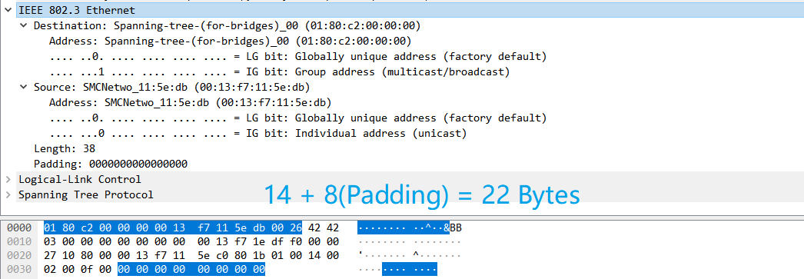

<!DOCTYPE html>
<html lang="en">
<head>
    <meta charset="UTF-8">
    <meta name="viewport" content="width=device-width, initial-scale=1.0">
    <title>实验报告封面</title>
    <style>
        .cover {
            font-family: 华文楷体, sans-serif;
            font-size: 18pt;
            margin-top: 0px;
            padding: 0;
            display: flex;
            align-items: center;
            justify-content: center;
            min-height: 100vh;
            /* page-break-before: auto;  或者直接删除这行 */
        }
        .cover #cover {
            text-align: center;
            position: relative;
        }
        .cover #logo {
            max-width: 100%;
            margin: 40px auto;
            display: block;
        }
        .cover #course {
            font-family: "华文行楷", sans-serif;
            font-size: 64px;
            margin: 20px;
            line-height: 1.3;
        }
        .cover #experiment {
            font-family: "华文楷体", sans-serif;
            font-size: 40px;
            margin: 30px 0;
        }
        .cover #info {
            text-align: center;
            margin: 20px;
            margin-top: 120px;
            position: relative;
        }
        .cover #info span {
            display: inline-block;
            text-align: left;
        }
        .cover #info span.label {
            font-family: "华文楷体", sans-serif;
            font-size: 22px;
            width: 100px;
        }
        .cover #info span.line {
            border-bottom: 1px solid #000;
            width: 150px;
            margin-bottom: -2pt;
            margin-left: -50px;
            display: inline-block;
            position: relative;
        }
        .cover #info span.text {
            position: absolute;
            font-family: "华文楷体", sans-serif;
            font-size: 22px;
            top: -16pt;
            left: 0;
            right: 0;
            text-align: center;
        }
    </style>
</head>
<body>
    <div class="cover">
        <div id="cover">
                        <div id="course">计算机网络<br/>实验报告</div>
            <div id="experiment">Lab8  Ethernet</div>
            <div id="info">
                <span class="label">姓名：</span>
                <span class="line">
                    <span class="text">O2iginal</span>
                </span><br>
                <span class="label">学号：</span>
                <span class="line">
                    <span class="text">O2iginal ID</span>
                </span><br>
                <span class="label">日期：</span>
                <span class="line">
                    <span class="text">2023-11-19</span>
                </span>
            </div>
        </div>
    </div>
</body>
</html>


<div>
    <div style="width:80px;float:left; font-family:方正公文黑体;">
        实验目的：
    </div>
    <div style="overflow:hidden; font-family:华文楷体;">
        探索以太网帧的结构，理解以太网协议的基本工作原理。
    </div>
    <div style="width:80px;float:left; font-family:方正公文黑体;">
        实验环境：
    </div>
    <div style="overflow:hidden; font-family:华文楷体;">
        WireShark；ping；
    </div>
</div>
<hr>
<center>
    <b>
        <h1>实验报告目录</h1>
    </b>
</center>


[TOC]

# Step 1: Capture a Trace

## 1.1 设置WireShark选项

1. 设置过滤器为`icmp`；
2. 打开`enable MAC name resolution`选项；
3. 关闭`capture packets in promiscuous mode`选项；
4. 确定`Link-layer header`选项为`Ethernet`，如下图所示；（注意到在新版的WireShark中，`Link-layer header`选项在`Capture Options`的`Input`选项卡的一列中）


## 1.2 Wireshark抓包

1）打开WireShark，开始抓包；

2）在命令行中输入`ping www.bing.com`，如下图所示；


3）结束抓包，查看抓包结果，如下图所示；


# Step 2: Inspect the Trace

选择Wireshark得到的第一条ping命令的请求报文，其以太帧头信息如下：

```sh
Ethernet II, Src: CyberTAN_0f:50:03 (b0:fc:36:0f:50:03), Dst: NewH3CTe_aa:3e:01 (fc:60:9b:aa:3e:01)
    Destination: NewH3CTe_aa:3e:01 (fc:60:9b:aa:3e:01)
        Address: NewH3CTe_aa:3e:01 (fc:60:9b:aa:3e:01)
        .... ..0. .... .... .... .... = LG bit: Globally unique address (factory default)
        .... ...0 .... .... .... .... = IG bit: Individual address (unicast)
    Source: CyberTAN_0f:50:03 (b0:fc:36:0f:50:03)
        Address: CyberTAN_0f:50:03 (b0:fc:36:0f:50:03)
        .... ..0. .... .... .... .... = LG bit: Globally unique address (factory default)
        .... ...0 .... .... .... .... = IG bit: Individual address (unicast)
    Type: IPv4 (0x0800)
```

其中，
- Destination为目的MAC地址，即`fc:60:9b:aa:3e:01`；
- Source为源MAC地址，即`b0:fc:36:0f:50:03`；
- Type为以太帧的类型，即`IPv4`；

# Step 3: Ethernet Frame Structure

## 绘制以太帧的结构图

*To show your understanding of the Ethernet frame format, draw a figure of the ping message that shows the position and size in bytes of the Ethernet header fields.*

绘制以太帧的结构图，如下图所示：

根据实验要求，Checksum部分用虚线框出，表示在Wireshark中没有显示此部分，但是实际存在。


# Step 4: Scope of Ethernet Addresses

## 绘制网络拓扑图（本机、网关、远程服务器）

*Draw a figure that shows the relative positions of your computer, the router, and the remote server.*

绘制网络拓扑图，如下图所示：


图中本机、网关的Mac地址来自Ethernet II帧的源地址和目的地址；本机、远程服务器的IP地址来自IP的头源地址和目的地址。


# Step 5: Broadcast Frames

## 抓取多播、广播帧

**1）**设置过滤器为`eth[0] & 1 != 0`；

经测试并查阅Wireshark文档，发现实验文档中`ether multicast`过滤器语法不能生效，而应该用`eth[0] & 1 != 0`来过滤多播帧。

原理：广播流量发送到一个保留的以太网地址，其中所有位都设置为"1"。组播流量发送到在发送到电缆上的第一个位上有"1"的地址；广播是组播的一个特例。因而可通过上述过滤器来过滤多播、广播帧。

**2）**Wireshark抓包，如下图所示；


## 问题1 Wireshark显示的广播地址

*What is the broadcast Ethernet address, written in standard form as Wireshark displays it?*

**答：**`ff:ff:ff:ff:ff:ff`

如下图所示：


## 问题2 区分单播与多播/广播的比特位

*Which bit of the Ethernet address is used to determine whether it is unicast or multicast/broadcast?*

**答：**第一字节的最后一位，即`eth[0] & 1 != 0`中的`1`。

如下图所示，即以太帧头的第八位。


# Explore on your own (IEEE 802.3)

## IEEE 802.3的帧结构

使用实验文档提供的`ethernet.pcap`文件，打开Wireshark，过滤器设置为`llc`查看IEEE 802.3的帧结构，如下图所示：


## 问题1：DIX与IEEE802.3以太帧头部长度对比

*How long are the combined IEEE 802.3 and LLC headers compared to the DIX Ethernet headers?*

**答：**DIX以太网帧头部长度为$14$字节，而IEEE 802.3以太网帧头部长度为$22$字节，因此IEEE 802.3以太网帧头部长度比DIX以太网帧头部长度长$8$字节。

IEEE 802.3帧头长度，如下图所示：



## 问题2：如何区分DIX和IEEE 802.3以太网帧

*How does the receiving computer know whether the frame is DIX Ethernet or IEEE 802.3?*

**答：**可根据帧头部的Type/Length字段数值来判断。如果Type/Length字段的值小于等于$1500$，则为IEEE 802.3以太网帧（该字段表示Length），否则为DIX以太网帧（该字段表示Type）。

## 问题3：IEEE 802.3以太网帧如何确定上层协议类型

*If IEEE 802.3 has no Type field, then how is the next higher layer determined?*

**答：**IEEE 802.3以太网帧的LLC头部中有一个DSAP字段和一个SSAP字段，这两个字段共同决定了下一层的协议类型。

如下图所示，LLC帧头的DSAP和SSAP字段的值都为`0x42`，则表示高层为`Spanning Tree Protocol`协议。


